# Dokumentasi Hasil Testing Semua Endpoint Via Swagger/Thunder  Client

1. POST/letters - Buat 3 letters

   - title : keluar, type : Leave Request

     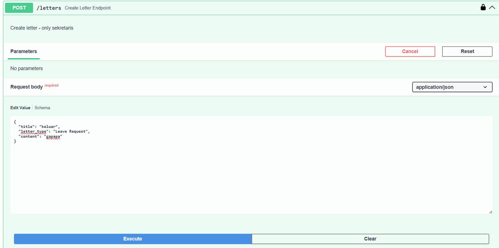
     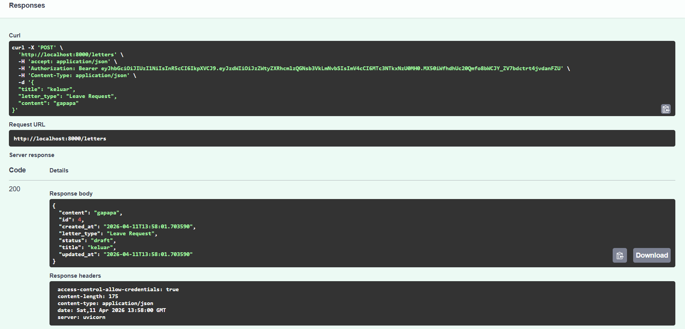
     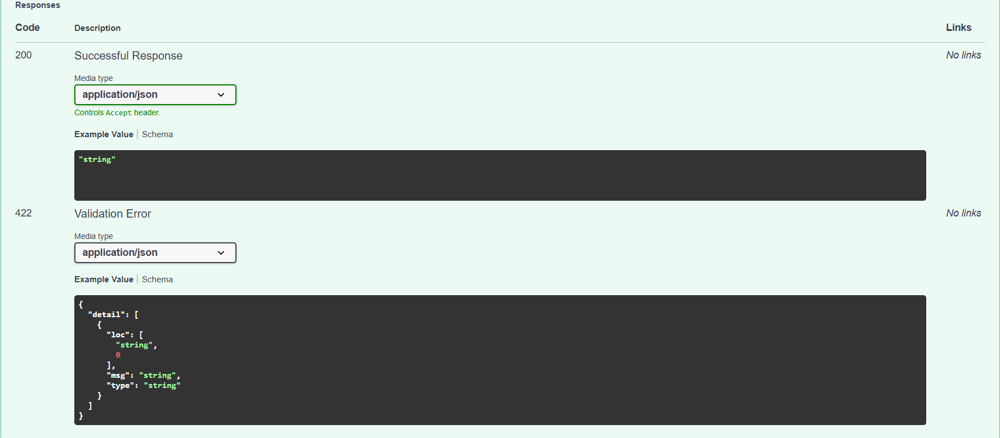

   - title : gak sesuai, type : Complaint

     
     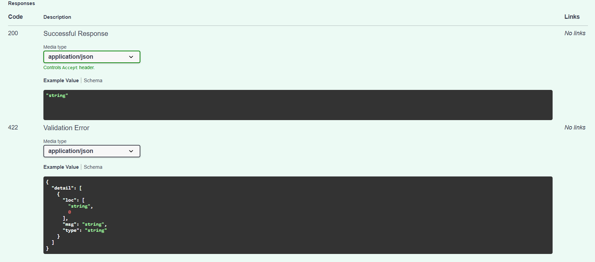
     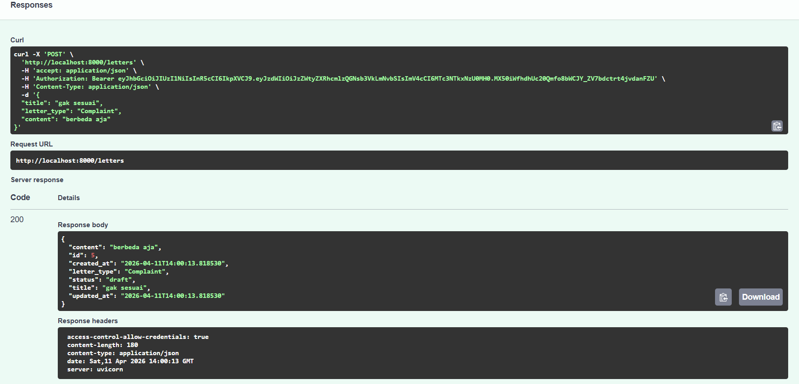

   - title : surat izin, type : Other

     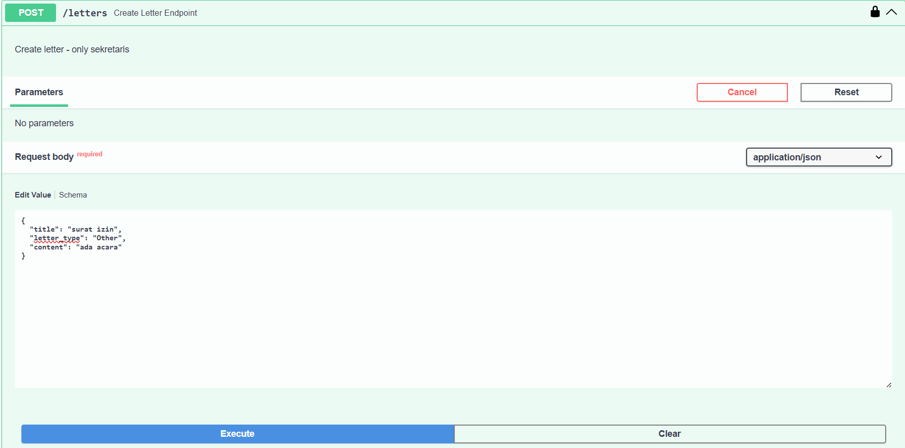
     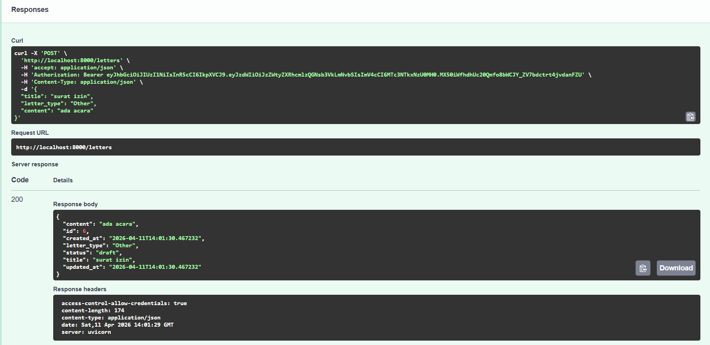
     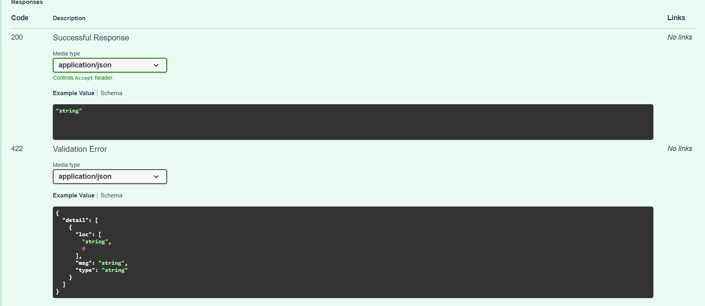

        Gambar tersebut menunjukkan tampilan pengujian API pada endpoint **POST/letters** yang berfungsi untuk membuat data surat baru. Pada bagian atas terlihat form Request Body dengan format JSON yang berisi beberapa field seperti title letter_type, dan content. Data tersebut merupakan payload yang dikirim ke server ketika tombol Execute ditekan. Karena endpoint ini ditujukan untuk pembuatan surat oleh sekretaris, sistem juga menyertakan token otorisasi pada bagian header sebagai bukti bahwa pengguna memiliki hak akses yang sesuai.

        Setelah request dikirim, bagian Responses menampilkan hasil yang dikembalikan oleh server. Di situ terlihat contoh curl command yang menggambarkan bagaimana request dikirim, lengkap dengan URL tujuan, header seperti Authorization dan Content-Type, serta isi JSON yang dikirimkan. Respons yang diterima memiliki kode 200, yang menandakan bahwa proses pembuatan surat berhasil. Pada bagian response body, server mengembalikan data surat yang berhasil dibuat, termasuk ID surat, isi konten, jenis surat, status yang masih berupa draft, serta informasi waktu pembuatan dan pembaruan data.

        Di bagian bawah juga terlihat dokumentasi respons lain yang mungkin terjadi, seperti 422 Validation Error, yang muncul jika data yang dikirim tidak memenuhi format atau aturan validasi. Dengan adanya dokumentasi tersebut, kita bisa mengetahui kemungkinan error yang dapat muncul dan bagaimana bentuk responsnya. Secara keseluruhan, tampilan ini menggambarkan proses lengkap pengujian API mulai dari input data, pengiriman request, hingga melihat respons yang dikembalikan oleh server.

2. GET/letters — Harus mengembalikan 3 letters dengan total : 3

   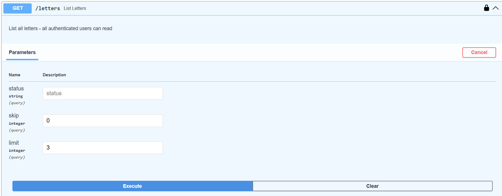
   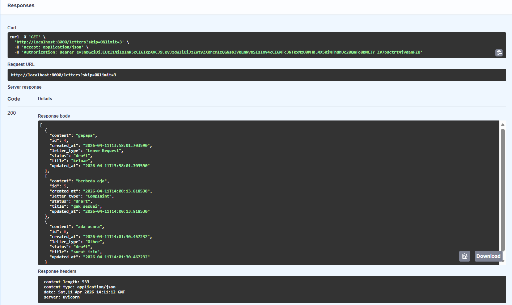
   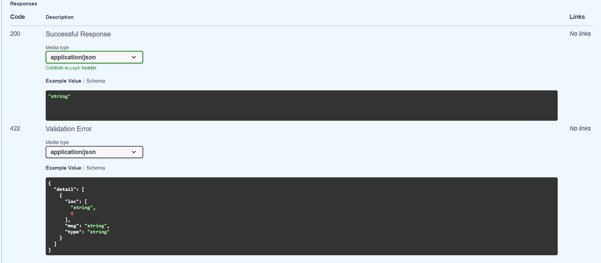

    Gambar tersebut menunjukkan dokumentasi dan hasil pengujian dari endpoint **GET/letters** yang berfungsi untuk mengambil daftar surat (letters). Endpoint ini mendukung fitur pagination menggunakan parameter `skip` untuk mengatur jumlah data yang dilewati dan `limit` untuk membatasi jumlah data yang ditampilkan, serta parameter opsional `status` yang dapat digunakan untuk memfilter surat berdasarkan status tertentu.

    Pengujian dilakukan dengan mengirimkan permintaan **GET** menggunakan cURL ke URL `http://localhost:8000/letters?skip=0&limit=3` dengan menyertakan **Authorization Bearer Token** sebagai tanda bahwa endpoint ini hanya dapat diakses oleh pengguna yang sudah terautentikasi. Server kemudian merespons dengan kode status **200 OK** yang menandakan permintaan berhasil diproses.

    Respons yang dikembalikan berupa JSON yang berisi array data surat sebanyak **3 item**, sesuai dengan nilai limit yang diberikan. Setiap data surat memiliki atribut seperti **id, title, content, letter_type, status, created_at, dan updated_at**. Dari hasil tersebut terlihat bahwa semua surat masih berstatus **draft**, dengan jenis yang berbeda seperti *Leave Request*, *Complaint*, dan *Other*. 

3. GET/letters/{letter_id} — Harus mengembalikan letter surat izin

   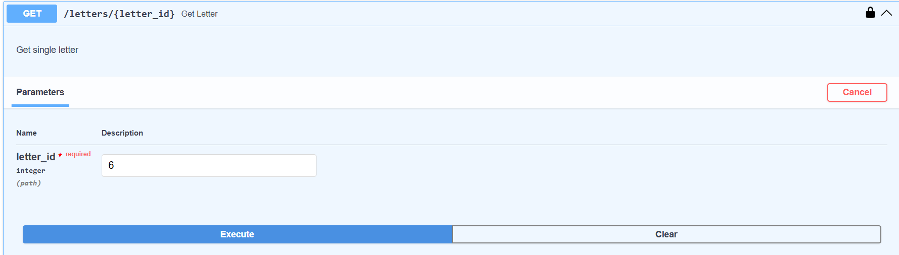
   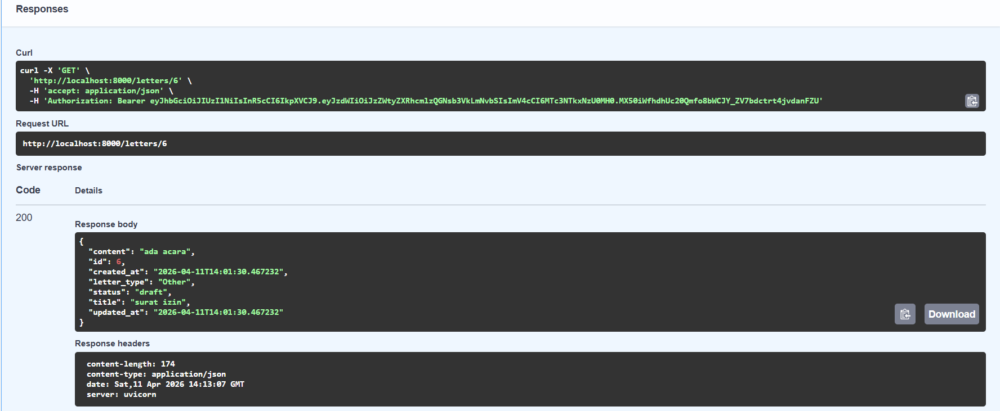
   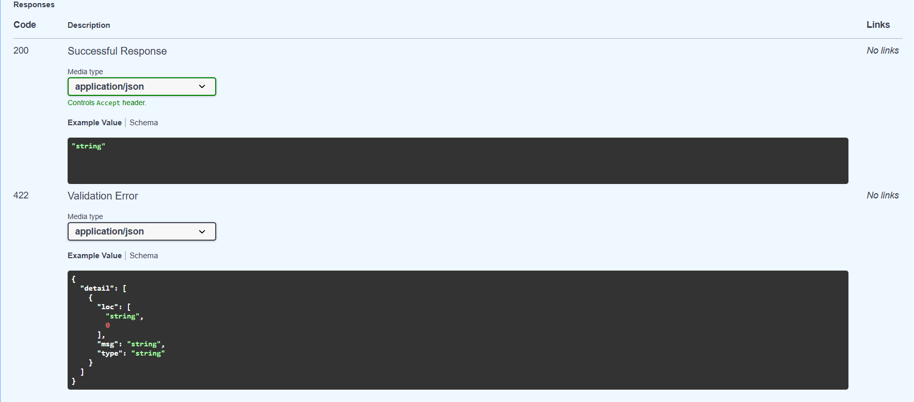

    Gambar tersebut menampilkan dokumentasi endpoint API untuk mengambil satu data surat (letter) berdasarkan ID menggunakan metode GET pada endpoint /letters/{letter_id}. Pada bagian parameter terlihat bahwa letter_id bersifat wajib dan diisi dengan angka 6, yang berarti sistem akan mengambil data surat dengan ID tersebut. Setelah tombol Execute dijalankan, ditampilkan contoh request dalam bentuk cURL yang menunjukkan URL http://localhost:8000/letters/6 beserta header Authorization Bearer token, yang menandakan bahwa endpoint ini membutuhkan autentikasi.

    Hasil dari request tersebut ditampilkan pada bagian Server response dengan kode 200 yang berarti permintaan berhasil. Response body berisi data dalam format JSON yang mencakup informasi surat seperti id, title, content, letter_type, status, serta waktu pembuatan dan pembaruan data. Dalam contoh ini, surat yang diambil memiliki judul “surat izin” dengan isi “ada acara” dan status masih “draft”. Selain itu, terdapat juga bagian Response headers yang memberikan informasi tambahan seperti tipe konten (application/json) dan server yang digunakan.

    Di bagian bawah dokumentasi juga ditampilkan kemungkinan respons lain yaitu 422 Validation Error, yang menunjukkan bahwa jika parameter tidak valid atau tidak sesuai, maka sistem akan mengembalikan pesan error dengan detail letak kesalahan. 

4. PUT/letters/{letter_id} — Update content surat izin : ada acara keluarga di luar kota

   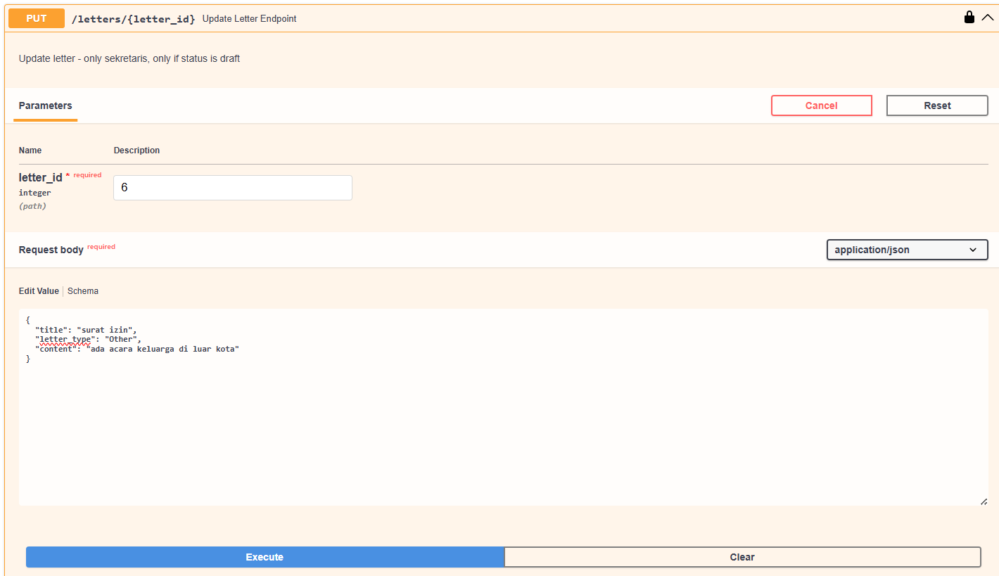
   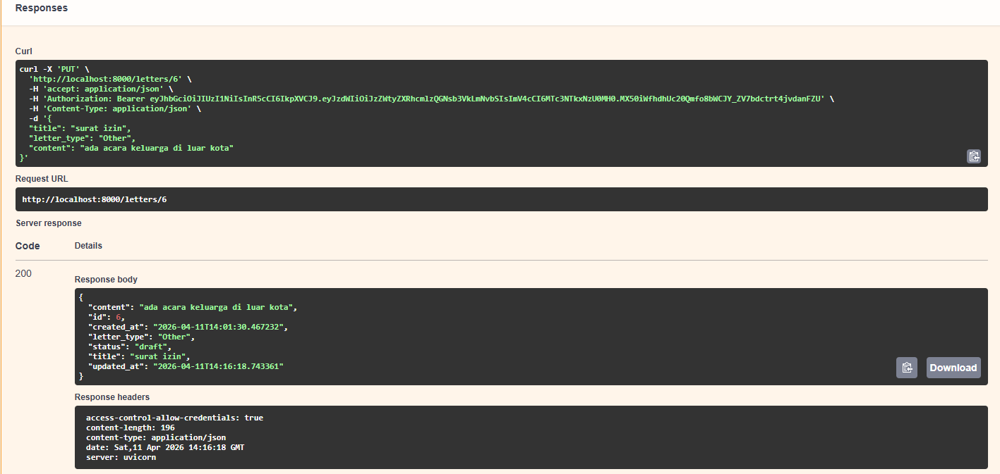
   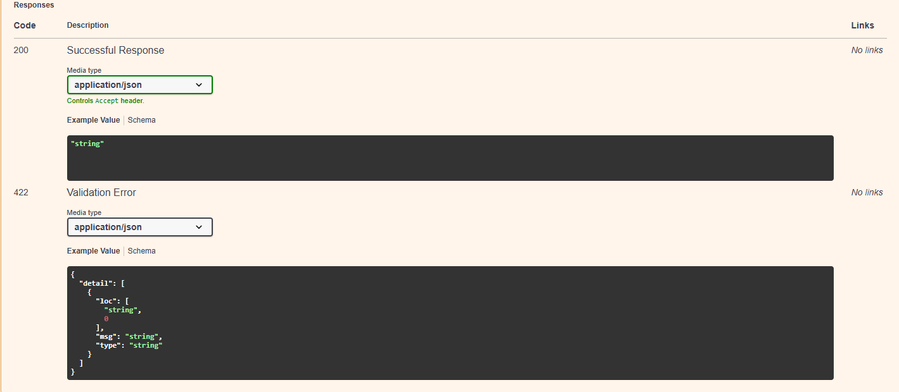

    Gambar tersebut menampilkan proses pengujian endpoint API **PUT/letters/{letter_id}** yang digunakan untuk melakukan update data surat. Endpoint ini hanya dapat diakses oleh pengguna dengan peran sekretaris dan hanya berlaku ketika status surat masih dalam kondisi draft. Pada bagian parameter, terlihat bahwa letter_id digunakan sebagai penanda unik surat yang ingin diperbarui, dengan contoh nilai 6. Selanjutnya, pada bagian request body ditampilkan data yang akan diubah dalam format JSON, meliputi judul surat, jenis surat, serta isi atau konten surat.

    Setelah data diinput, sistem menghasilkan perintah cURL yang merepresentasikan request HTTP lengkap, termasuk metode PUT, URL endpoint, header seperti Authorization Bearer Token untuk autentikasi, serta Content-Type yang menunjukkan bahwa data dikirim dalam format JSON. Hal ini menunjukkan bahwa endpoint sudah dilengkapi mekanisme keamanan berbasis token.

    Pada bagian response, sistem mengembalikan status kode 200 yang menandakan bahwa proses update berhasil dilakukan. Response body berisi data surat yang telah diperbarui, termasuk informasi seperti id, title, content, letter_type, status, serta timestamp pembuatan dan pembaruan data. Status yang tetap draft menunjukkan bahwa perubahan tidak mengubah status utama surat. Selain itu, response headers memberikan informasi tambahan terkait server dan format respons.

5. GET/letters/{letter_id} — Content surat izin harus berubah ke ada acara keluarga di luar kota

   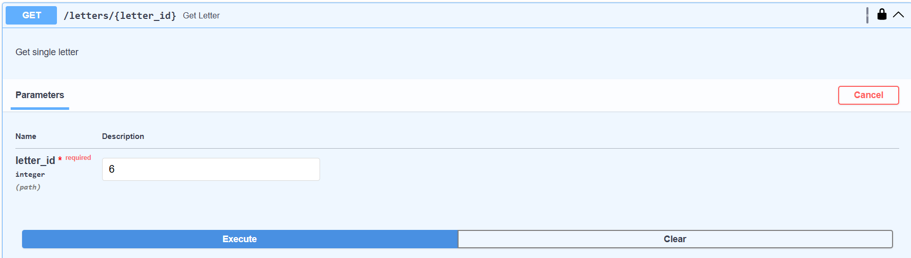
   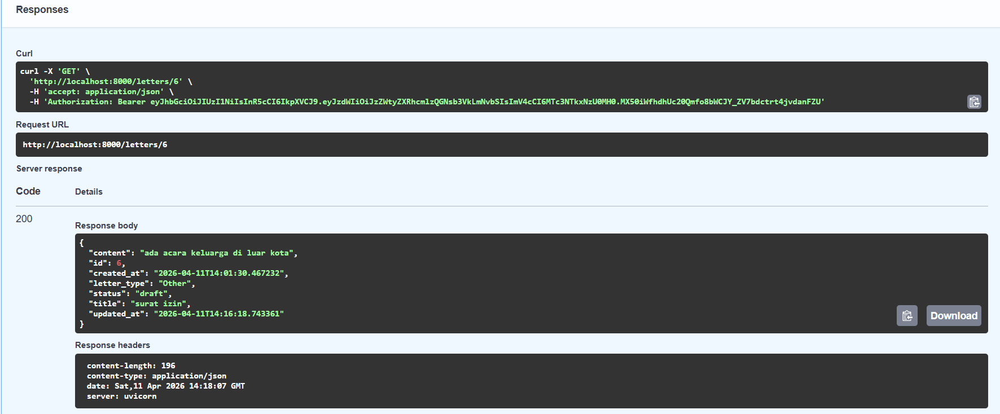
   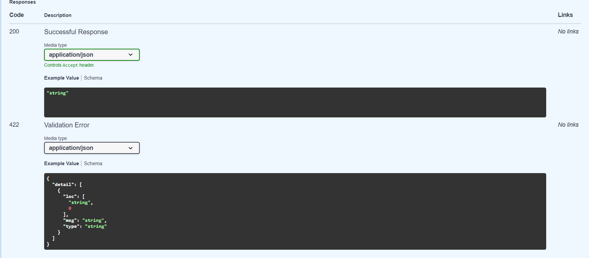

    Gambar tersebut menunjukkan proses pengujian endpoint API menggunakan tampilan dokumentasi interaktif (Swagger). Endpoint yang sedang diuji adalah **GET/letters/{letter_id}**, yang berfungsi untuk mengambil data satu surat berdasarkan ID tertentu. Pada bagian parameter terlihat bahwa letter_id diisi dengan angka 6, yang berarti sistem akan mencari data surat dengan ID tersebut. Setelah tombol Execute dijalankan, sistem mengirim request ke URL http://localhost:8000/letters/6 dengan metode GET serta menyertakan Authorization Bearer Token, yang menandakan bahwa endpoint ini memerlukan autentikasi.

    Hasil dari request tersebut ditampilkan pada bagian Server response dengan kode 200, yang berarti permintaan berhasil diproses. Response body berisi data surat dalam format JSON, seperti isi surat (“ada acara keluarga di luar kota”), ID, waktu pembuatan dan pembaruan, tipe surat (“Other”), status (“draft”), serta judul (“surat izin”). Ini menunjukkan bahwa API sudah berjalan dengan baik karena mampu mengembalikan data sesuai dengan ID yang diminta. Dan terlihat bahwa hasilnya berbeda dari yang sebelumnya, yang dimana terdapat perubahan pada isi content, yaitu sebelumnya "ada acara" dan sekarang telah berubah menjadi "ada acara keluarga di luar kota"

    Selain itu, di bagian bawah juga terlihat dokumentasi kemungkinan response lain, yaitu 422 Validation Error, yang akan muncul jika input tidak valid, misalnya parameter tidak sesuai format atau tidak dikirim dengan benar. 

6. DELETE/letters/{letter_id} — Surat izin harus response 200

   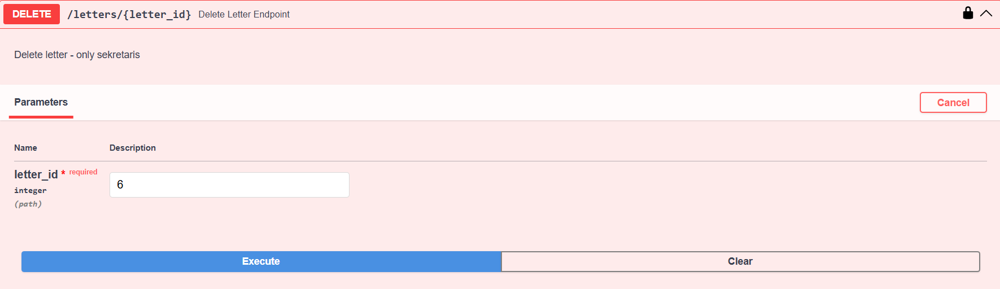
   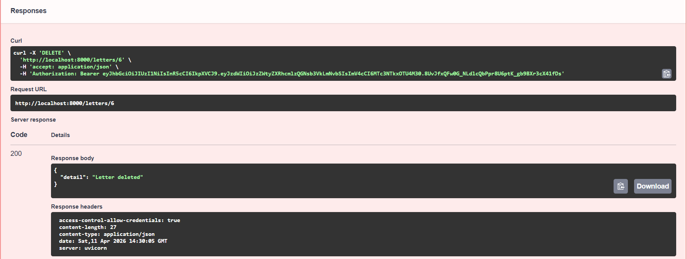
   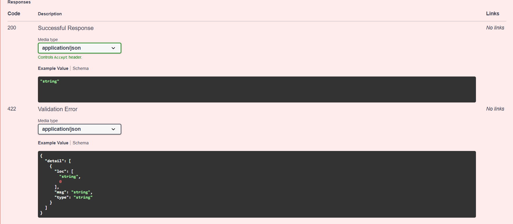

    Gambar tersebut menampilkan dokumentasi dan hasil pengujian endpoint API untuk fitur hapus data surat (delete letter) menggunakan metode HTTP DELETE. Endpoint yang digunakan adalah **DELETE/letters/{letter_id}**, yang berarti sistem akan menghapus data surat berdasarkan ID tertentu. Pada tampilan terlihat bahwa parameter yang wajib diisi adalah letter_id dengan tipe data integer, dan pada contoh ini diisi dengan nilai 6, sehingga sistem akan mencoba menghapus surat dengan ID tersebut.

    Proses eksekusi dilakukan melalui Swagger UI, di mana setelah tombol Execute ditekan, sistem mengirim request ke URL http://localhost:8000/letters/6. Request ini juga menyertakan header penting, yaitu Authorization: Bearer token, yang menandakan bahwa endpoint ini dilindungi dan hanya bisa diakses oleh user yang memiliki hak akses, dalam hal ini hanya untuk sekretaris.

    Hasil response dari server menunjukkan kode status 200 (Successful Response), yang berarti permintaan berhasil diproses tanpa error. Pada bagian response body terdapat pesan "detail": "Letter deleted", yang menegaskan bahwa data surat dengan ID tersebut berhasil dihapus dari sistem. Selain itu, response headers juga ditampilkan sebagai informasi tambahan terkait konfigurasi server, seperti content type JSON dan server yang digunakan yaitu uvicorn.

    Di bagian bawah juga ditampilkan kemungkinan response lain yaitu 422 Validation Error, yang akan muncul jika parameter yang dikirim tidak sesuai, misalnya letter_id kosong atau bukan angka. Namun pada proses ini tidak terjadi error karena input sudah valid.

7. GET /letters/{letter_id} — Surat izin harus response 404

   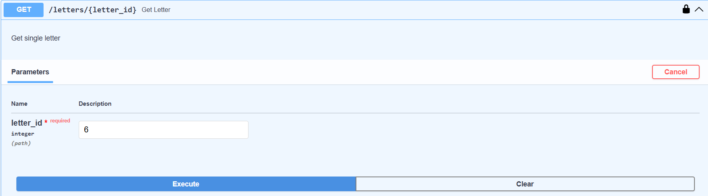
   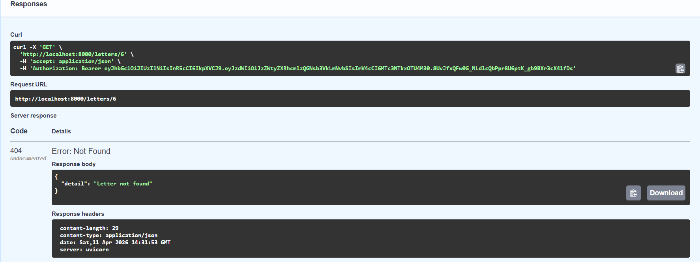
   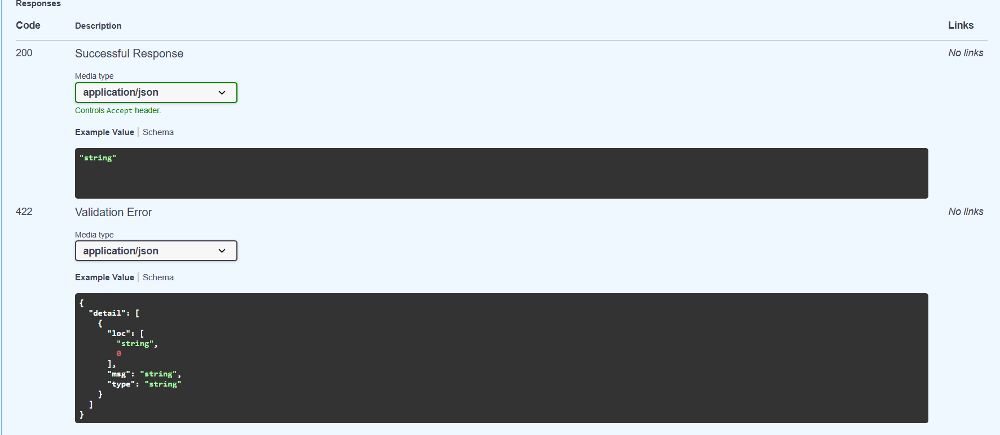

    Gambar tersebut menampilkan proses pengujian endpoint API **GET/letters/{letter_id}** menggunakan antarmuka dokumentasi API (Swagger). Endpoint ini digunakan untuk mengambil satu data surat (letter) berdasarkan ID tertentu. Pada bagian parameter terlihat bahwa sistem meminta letter_id yang bertipe integer dan bersifat required, artinya nilai tersebut wajib diisi agar permintaan dapat dijalankan. Pada gambar tersebut, pengguna memasukkan nilai 6 sebagai letter_id, sehingga sistem akan mencoba mengambil data surat dengan ID 6 dari server.

    Setelah parameter diisi dan tombol Execute ditekan, sistem menampilkan contoh perintah cURL yang sebenarnya dijalankan oleh aplikasi. Perintah tersebut menggunakan metode GET ke alamat http://localhost:8000/letters/6, yang berarti permintaan dikirim ke server lokal pada port 8000. Dalam request tersebut juga terdapat header accept: application/json yang menunjukkan bahwa client mengharapkan respon dalam format JSON. Selain itu terdapat header Authorization: Bearer token, yang menandakan bahwa endpoint ini menggunakan autentikasi berbasis token (JWT atau bearer token) sehingga hanya pengguna yang memiliki token yang valid yang dapat mengakses data.

    Pada bagian Request URL, terlihat alamat endpoint yang benar-benar dipanggil oleh sistem yaitu http://localhost:8000/letters/6. Namun pada bagian Server Response, server mengembalikan kode status 404 Not Found. Kode ini menunjukkan bahwa permintaan berhasil diterima oleh server, tetapi data yang diminta tidak ditemukan. Hal ini diperjelas oleh response body yang berisi pesan JSON { "detail": "Letter not found" }, yang berarti server tidak menemukan data surat dengan ID 6 di dalam database atau penyimpanan data. Sehingga dapat dikatakan bahwa data dengan id 6 benar-benar telah terhapus.

    Di bagian bawah dokumentasi juga ditampilkan informasi Responses yang menjelaskan kemungkinan respon dari endpoint tersebut. Untuk kode 200 Successful Response, server seharusnya mengembalikan data dalam format application/json jika surat dengan ID yang diminta berhasil ditemukan. Selain itu juga terdapat kemungkinan 422 Validation Error, yang biasanya terjadi jika parameter yang diberikan tidak valid, misalnya tipe data salah atau parameter yang wajib tidak diisi.

    