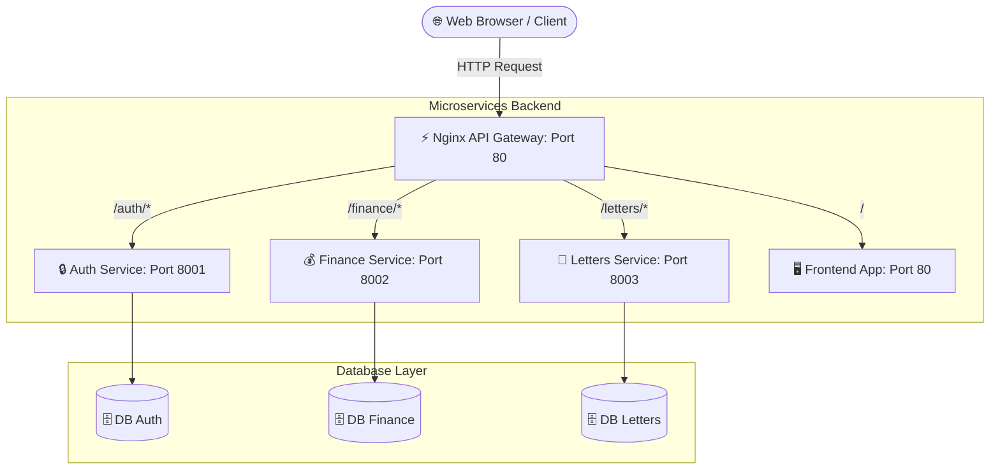

# Dokumentasi Arsitektur Microservices - SIKASI

Dokumen ini menjelaskan struktur arsitektur, pemetaan port, kontrak API (*API Contract*), serta panduan operasional lokal untuk sistem informasi Keuangan dan Administrasi (SIKASI) berdasarkan konfigurasi Nginx Gateway asli.

---

## 1. Diagram Arsitektur (Mermaid)
Berikut adalah visualisasi aliran data dari pengguna melewati Nginx Reverse Proxy (Gateway) menuju masing-masing komponen *microservices*:


---

## Daftar Services & Pemetaan Port
Seluruh layanan dikelola secara terpusat oleh Nginx upstream dengan pemetaan port kontainer aktif sebagai berikut:
| Nama Upstream | Port Internal Container | Path Gateway | Keterangan | 
| ------------- | ------------------ | ------- | ---------- | 
| frontend_service | `80` | `/` (Root) | Melayani static files antarmuka pengguna (Frontend React). |
| auth_service | `8001` | `/auth` | Manajemen user, enkripsi password, registrasi, & JWT. |
| finance_service | `8002` | `/finance` | Manajemen keuangan, pencatatan transaksi masuk/keluar. | 
| letters_service | `8003` | `/letters` | Pengelolaan dokumen administratif dan surat-menyurat. | 

---
## API Contract Setiap Service
### Auth Service (/auth)
POST `/auth/register`
- Payload (Request): `{"username": "string", "email": "string", "password": "string"}`
- Response (201): `{"status": "success", "message": "User registered"}`
<p>

POST `/auth/login`
- Payload (Request): `{"username": "string", "password": "string"}`
- Response (200): `{"access_token": "token_string", "token_type": "bearer"}`

### Finance Service (/finance)
GET `/finance/summary`
- Response (200): `{"total_pemasukan": 50000000, "total_pengeluaran": 20000000, "saldo_bersih": 30000000}`

POST `/finance/transaction`
- Payload (Request): `{"tipe": "string", "nominal": 0, "keterangan": "string"}`
- Response (201): `{"status": "success", "message": "Transaction recorded"}`

---
## Cara Menjalankan secara Local (Local Development)
Sistem SIKASI memanfaatkan Docker Compose terintegrasi dengan Makefile untuk mengontrol jalannya Nginx Gateway dan microservices secara bersamaan.

Jalankan perintah ini di terminal root direktor:
| Perintah | Keterangan | 
|--------- | ---------- |
| make up  | Menyalakan seluruh microservices & Nginx Gateway |
| make logs | Memantau logs jalannya sistem secara real-time |
| make down | Mematikan seluruh kontainer secara bersih |
| make restart | Merestart container jika ada perubahan file konfigurasi nginx |

---

## Cara Debug Per Service
Jika sistem mengalami kendala interkoneksi, gunakan alur pengecekan berikut:
1. Cek Konektivitas Sentral Nginx :  <br>
    Pastikan port utama 80 merespons health check (yang dioperkan ke auth_service):
    ```
    curl -I http://localhost/health
    ```
2. Isolasi Log Kontainer Tertentu:<br>
    Jika fitur administrasi atau keuangan macet, langsung tembak ke logs spesifik kontainer service-nya:
    ```
    docker logs -f cc-kelompok-hexagroup-finance-service-1
    ```

3. Bypass Pengujian Port Internal
    Uji langsung ke port internal service tanpa lewat Nginx untuk memastikan apakah error bersumber dari kodingan atau salah routing:
    - Test langsung Auth : curl http://localhost:8001/auth/login
    - Test langsung Finance: curl http://localhost:8002/finance/summary
