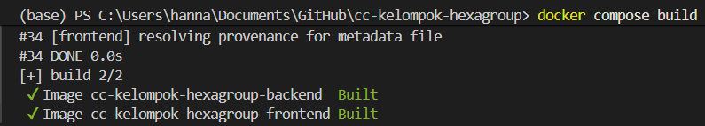
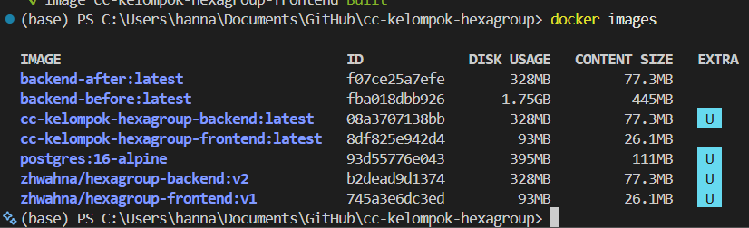
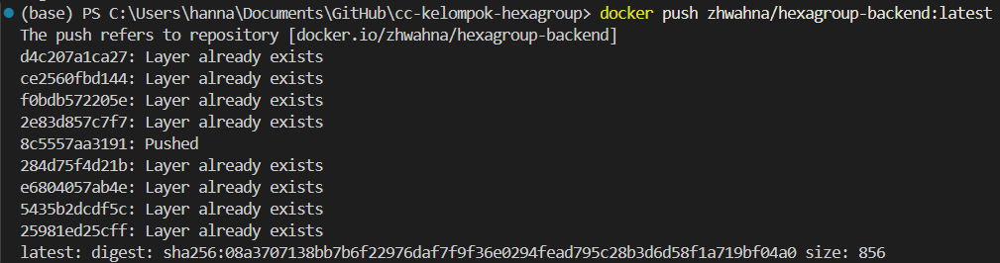
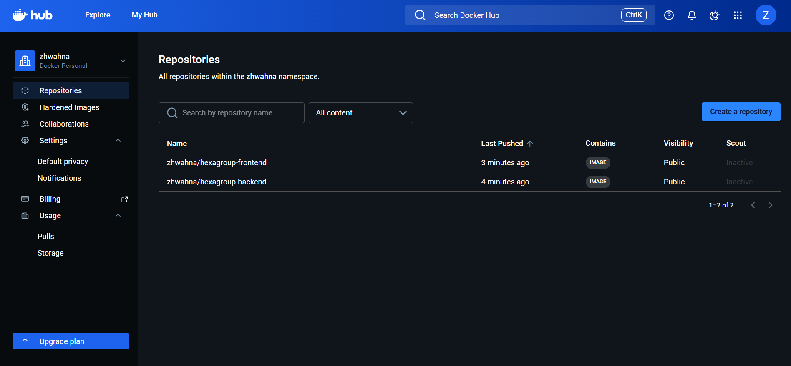

# Docker Images Documentation

- Build image backend dan frontend menggunakan Docker Compose
- Melakukan tagging image dengan versi `latest`
- Push image ke Docker Hub
- Mendokumentasikan nama image, ukuran image, dan hasil push
- Menyiapkan image agar dapat digunakan kembali melalui `docker pull`

---

## 1. Build Semua Image

Command yang digunakan:

```bash
docker compose build
```

Command ini buat membaca file docker-compose.yml lalu membangun image untuk seluruh service yang menggunakan Dockerfile, yaitu:
- Backend
- Frontend



---

## 2. Cek Image yang Berhasil Dibuat

Image yang tersedia di local Docker, cek menggunakan command

```bash
docker images
```



---

## 3. Tagging Image ke Docker Hub

Sebelum dipush, image lokal diberi nama sesuai sama repository Docker Hub. Dengan menggunakan command:

```bash
docker tag cc-kelompok-hexagroup-backend zhwahna/hexagroup-backend:latest

docker tag cc-kelompok-hexagroup-frontend zhwahna/hexagroup-frontend:latest
```

Tagging ini digunakan supaya image lokal terhubung dengan akun Docker Hub sehingga dapat di-upload.

---

## 4. Push Image ke Docker Hub

Command ini buat mengupload image dari local Docker ke Docker Hub.

```bash
docker push zhwahna/hexagroup-backend:latest
docker push zhwahna/hexagroup-frontend:latest
```

Setelah berhasil dipush, image dapat digunakan kembali dengan command:

```bash
docker pull zhwahna/hexagroup-backend:latest
docker pull zhwahna/hexagroup-frontend:latest
```




---

## 5. Repository Docker Hub

Setelah pushnya berhasil, repository yang tersedia:

