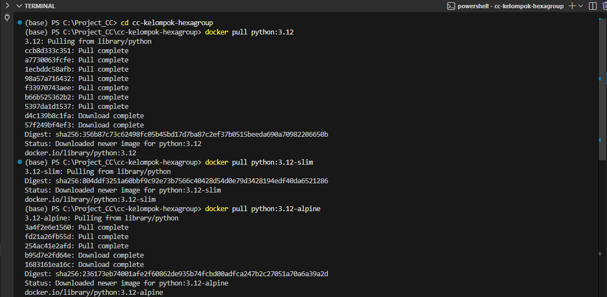
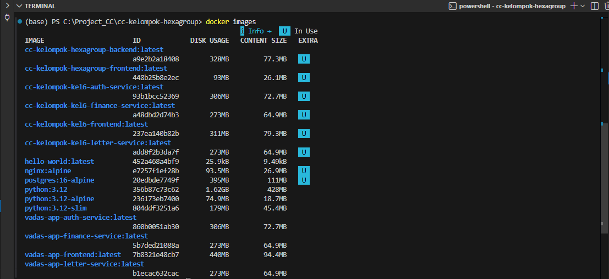

# 🐳 Docker Image Comparison

Membandingkan beberapa base image Python yang digunakan dalam Docker untuk menentukan image yang paling optimal digunakan dalam pengembangan dan deployment aplikasi.

1. Download Image <br>
    Menggunakan perintah berikut:
    ```
    docker pull python:3.12
    docker pull python:3.12-slim
    docker pull python:3.12-alpine
    ```
     <p>

2. Cek hasil <br>
    Menggunakan perintah berikut:
    ```
    docker images
    ```
     <p>

## 📊 Perbandingan Ukuran Image
| Image | Disk Usage | Content Size | Keterangan |
|------|-----------|-------------|-----------|
| python:3.12 | 1.62 GB | 428 MB | Image lengkap dengan semua dependensi |
| python:3.12-slim | 179 MB | 45.4 MB | Versi lebih ringan dari image full |
| python:3.12-alpine | 74.9 MB | 18.7 MB | Image paling kecil berbasis Alpine Linux |

---

## 🔍 Analisis

### 1. python:3.12
- Ukuran paling besar (1.62 GB)
- Memiliki semua dependensi bawaan
- Tidak perlu banyak konfigurasi tambahan
- Cocok untuk development

### 2. python:3.12-slim
- Ukuran jauh lebih kecil (179 MB)
- Tetap kompatibel dengan sebagian besar library Python
- Lebih efisien dibanding versi full
- Cocok untuk production

### 3. python:3.12-alpine
- Ukuran paling kecil (74.9 MB)
- Menggunakan Alpine Linux
- Perlu konfigurasi tambahan (misalnya install build tools)
- Berpotensi mengalami masalah dependency

---

## ⚖️ Perbandingan Singkat

| Aspek | python:3.12 | python:3.12-slim | python:3.12-alpine |
|------|------------|------------------|--------------------|
| Ukuran | ❌ Sangat besar | ⚖️ Sedang | ✅ Paling kecil |
| Kemudahan penggunaan | ✅ Mudah | ✅ Mudah | ❌ Lebih sulit |
| Kompatibilitas library | ✅ Tinggi | ✅ Tinggi | ⚠️ Kadang bermasalah |
| Cocok untuk production | ❌ Kurang efisien | ✅ Sangat cocok | ⚠️ Tergantung kebutuhan |

---

## ✅ Kesimpulan

Berdasarkan hasil pengujian:

👉 Image yang direkomendasikan adalah:
**python:3.12-slim**

### Alasan:
- Ukuran jauh lebih kecil dari versi full (179 MB vs 1.62 GB)
- Lebih stabil dibanding alpine
- Tidak memerlukan banyak konfigurasi tambahan
- Cocok untuk deployment production

---

## 📌 Rekomendasi Penggunaan

| Kebutuhan | Image |
|----------|------|
| Development | python:3.12 |
| Production (disarankan) | python:3.12-slim |
| Optimasi ukuran ekstrem | python:3.12-alpine |

---

## 🧪 Metode Pengujian

Pengujian dilakukan menggunakan perintah berikut:

```bash
docker pull python:3.12
docker pull python:3.12-slim
docker pull python:3.12-alpine
docker images