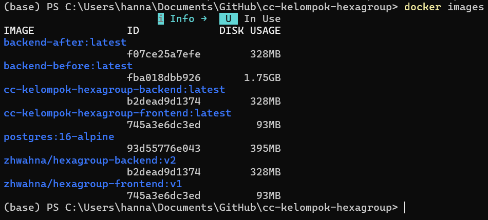
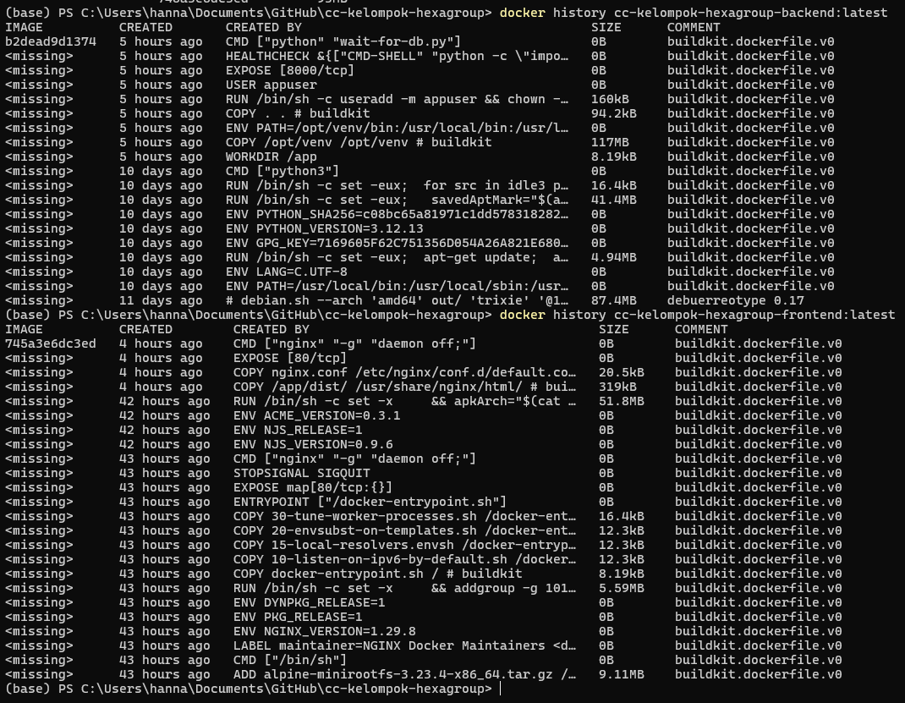
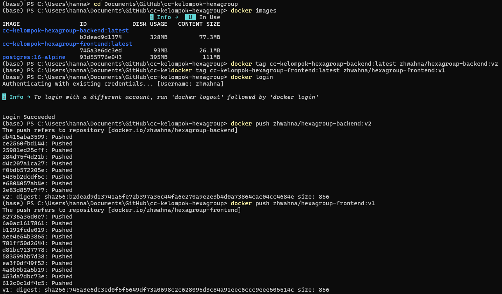

## Ukuran sebelum vs sesudah optimasi

### Container di SIKASI:
- Backend (Python / FastAPI)
- Frontend (React + Nginx)
- Database PostgreSQL
---

### Backend
Optimasi yang diterapkan:

- Menggunakan `python:3.12-slim`
- Multi-stage build
- `pip install --no-cache-dir`
- Menjalankan container dengan non-root user

Sebelum dan sesudah optimasi:



Ukuran image yang sebelumnya 1.75GB saat ini menjadi 328 MB, dibanding base image Python reguler, penggunaan versi slim bisa ngebantu menekan ukuran image jadi lebih kecil.

---

### Frontend
Optimasi yang diterapkan:

- Build menggunakan `node:20-alpine`
- Production runtime menggunakan `nginx:alpine`
- Multi-stage build (builder + runtime)

Ukuran image saat ini adalah 93 MB, dibanding menjalankan React app langsung di Node image, penggunaan Nginx Alpine bisa membuat image lebih kecil ukurannya.

---

### Kesimpulan
Docker image backend dan frontend sudah menggunakan strategi optimasi untuk mengurangi ukuran image dan meningkatkan efisiensi deployment.

### Tambahan
Untuk melihat susunan layer image dan ukuran setiap proses build, pakai:
```bash
docker history cc-kelompok-hexagroup-backend:latest
docker history cc-kelompok-hexagroup-frontend:latest
```



---

### Tugas CI/CD Modul 06
Push backend:v2 & frontend:v1 ke Docker Hub.



Setelah proses build dan optimasi selesai, image project dipush ke Docker Hub.

Image yang berhasil dipush:

- `zhwahna/hexagroup-backend:v2`
- `zhwahna/hexagroup-frontend:v1`

Perintah yang dipakai:

```bash
docker push zhwahna/hexagroup-backend:v2
docker push zhwahna/hexagroup-frontend:v1