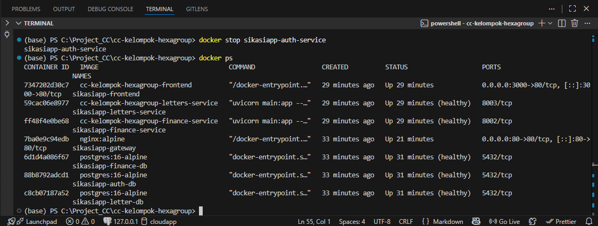
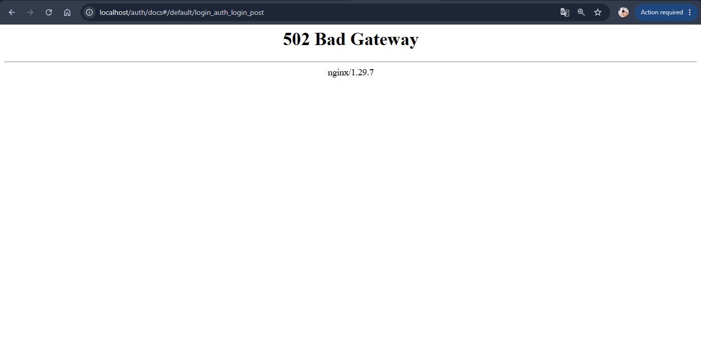
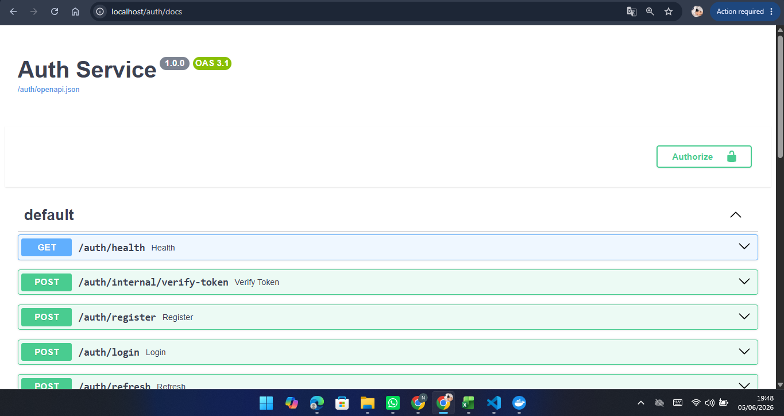

# Reliability Testing Documentation

Dokumen ini menjelaskan pengujian ketahanan (*reliability testing*) pada sistem untuk memastikan aplikasi tetap dapat memberikan respons yang baik ketika terjadi gangguan pada layanan eksternal.

---

## Test Environment

| Komponen | Keterangan |
|-----------|------------|
| Frontend | React |
| Gateway | Nginx |
| Auth Service | Port 8001 |
| Finance Service | Port 8002 |
| Letters Service | Port 8003 |
| Docker | Docker Compose |

---

## Skenario Test
### Skenario Test 1 (Auth Service Down)

Memastikan sistem tetap berjalan ketika Auth Service tidak tersedia.

#### Reproduce Steps
1. Pastikan seluruh service berjalan.
    ```
    docker ps
    ```
2. Matikan Auth Service dengan perintah: 
    ```
    docker stop sikasiapp-auth-service
    ```
3. Buka endpoint Swagger melalui Gateway.
    ```
    http://localhost/docs
    ```

#### Expected Behavior
- Auth Service tidak dapat diakses.
- Gateway tetap berjalan.
- Request yang membutuhkan Auth Service gagal diproses.
- Sistem menampilkan error gateway.

#### Actual Result
Setelah Auth Service dimatikan, saat mengakses:
http://localhost/docs

Sistem menampilkan: 

`502 Bad Gateway` <br>
`nginx`

#### Actual Result



Berdasarkan hasil tersebut pengujian berhasil (PASS) karena telah menampilkan hasil yang sesuai dengan expected Behavior, dimana Nginx Gateway tetap berjalan dan berhasil mendeteksi bahwa Auth Service tidak tersedia dan request yang membutuhkan Auth Service tidak dapat diteruskan ke service tujuan sehingga Gateway mengembalikan response error yang sesuai.

### Skenario Test 2 (Timeout Handling)
Memastikan sistem mampu menangani request yang melebihi batas waktu respons.

#### Reproduce Steps
Simulasi timeout dilakukan dengan memberikan delay pada Auth Service atau memutus koneksi service sementara.

#### Expected Behavior
- Request yang melebihi batas waktu akan dihentikan.
- Gateway mengembalikan response error yang sesuai.
- Service lain tetap berjalan normal.
- Sistem tidak mengalami crash.

#### Actual Result
Belum dilakukan pengujian secara langsung pada lingkungan pengembangan sehingga pada skenario test ini berstatus PLANNED TEST.

### Skenario Test 3 (Service Recovery)
Memastikan sistem dapat kembali berjalan normal setelah Auth Service diaktifkan kembali.

#### Reproduce Steps
1. Jalankan kembali Auth Service dengan perintah:
    ```
    docker start sikasiapp-auth-service
    ```
2. Pastikan service berstatus healthy.
    ```
    docker ps
    ```
3. Restart Gateway jika diperlukan dengan perintah:
    ```
    docker restart sikasiapp-gateway
    ```
4. Buka kembali Swagger. <br>
    http://localhost/docs

#### Expected Behavior
- Auth Service kembali online.
- Gateway dapat meneruskan request ke Auth Service.
- Swagger dapat diakses kembali.
- Tidak ada lagi error 502 Bad Gateway.

#### Actual Result

Berdasarkan hasil tersebut menunjukkan bahwa Auth Service berhasil (PASS) kembali berjalan dengan status healthy dan sistem dapat diakses kembali melalui Gateway.


### Test Summary
| Skenario | Status |
|-----------|------------|
| Auth Service Down | PASS |
| Timeout Handling | PLANNED TEST |
| Service Recovery | PASS |

## Conclusion
Berdasarkan hasil pengujian, sistem SIKASI berhasil mendeteksi ketika Auth Service tidak tersedia dan mengembalikan response 502 Bad Gateway melalui Nginx Gateway. Setelah service dijalankan kembali, sistem mampu melakukan recovery dan kembali melayani request secara normal. Pengujian timeout belum dilakukan dan direkomendasikan sebagai pengujian lanjutan.