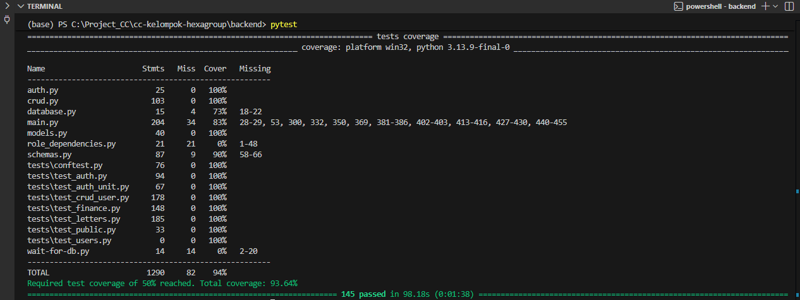

# Testing Guide

Dokumen ini menjelaskan alur pengujian untuk Backend dan Frontend serta cara menangani integrasi di CI Pipeline.

---

## 1. Menjalankan Test Lokal (Local Run)

### 🐍 Backend (FastAPI + pytest)

#### Install Dependency
1. Masuk ke direktori backend: `cd backend`
2. Install dependency testing:
    ```bash
    pip install pytest pytest-cov httpx
    ```
    atau install dari requirements.txt:
    ```bash
    pip install -r requirements.txt
    ```

#### Menjalankan Test Backend
1. Jalankan perintah:
   ```bash
   pytest
   ```
2. Output yang dihasilkan
    
    


