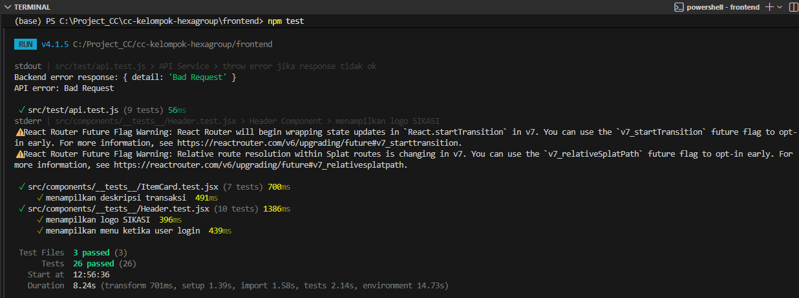

# Testing Guide

Dokumen ini menjelaskan alur pengujian untuk Backend dan Frontend serta cara menangani integrasi di CI Pipeline.

---

## 1. Menjalankan Test Lokal (Local Run)

### 🐍 Backend (FastAPI + pytest)

#### Install Dependency
1. Masuk ke direktori backend: `cd backend`
2. Install dependency testing:
    ```bash
    pip install pytest pytest-cov httpx
    ```
    atau install dari requirements.txt:
    ```bash
    pip install -r requirements.txt
    ```

#### Menjalankan Test Backend
1. Jalankan perintah:
   ```bash
   pytest
   ```

#### Menjalankan Test dengan Coverage
```bash
pytest --cov=. --cov-report=term-missing
```
Coverage minimal yang digunakan di CI adalah:

```text
50%
```

#### Struktur Testing Backend
```text
backend/tests/
├── conftest.py
├── test_auth_unit.py
├── test_auth.py
├── test_crud_user.py
├── test_finance.py
├── test_letters.py
├── test_public.py
└── test_users.py
```

#### Output yang dihasilkan

Berdasarkan gambar tersebut, output yang dihasilkan menunjukkan bahwa backend diuji menggunakan framework pytest, mencapai cakupan kode (coverage) sebesar 93.64% yang jauh melampaui target minimum 50%. Sebanyak 145 test case berhasil dijalankan dengan status lulus 100%, menjamin keamanan fitur krusial seperti autentikasi, manajemen database (CRUD), dan validasi skema. Pengujian ini terintegrasi dalam CI Pipeline dan menggunakan database SQLite in-memory untuk memastikan proses validasi yang cepat, terisolasi, dan otomatis pada setiap perubahan kode.


### ⚛️ Frontend (React + Vitest)
#### Install Dependency
1. Masuk ke direktori frontend: `cd frontend`
2. Install dependency
    ```bash
    npm install
    ```

    Install testing dependency:

    ```bash
    npm install --save-dev vitest @testing-library/react @testing-library/jest-dom jsdom
    ```

#### Menjalankan Test Frontend
1. Jalankan perintah:
   ```bash
   npm test
   ```

#### Menjalankan Test Watch Mode
```bash
npm run test:watch
```

#### Menjalankan Test Coverage

```bash
npm run test:coverage
```

#### Struktur Testing Frontend
```text
frontend/src/
├── components/__tests__/
│   ├── Header.test.jsx
│   └── ItemCard.test.jsx
└── test/
    ├── setup.js
    └── api.test.js
```

#### Output yang dihasilkan

Berdasarkan gambar tersebut, output yang dihasilkan menunjukkan bahwa frontend diuji menggunakan framework Vitest dan React Testing Library. Sebanyak 26 skenario pengujian dari 3 file test utama berhasil dijalankan dengan status lulus 100%. Pengujian ini mencakup validasi komponen UI krusial seperti Header (Logo SIKASI & Menu Login) dan ItemCard (Deskripsi Transaksi) untuk memastikan antarmuka pengguna berfungsi dengan benar dan responsif terhadap perubahan data.

---

## 2. Cara Membaca CI Log (GitHub Actions)
CI pipeline berjalan otomatis saat:
- push ke branch main
- membuat pull request ke main

### Cara Melihat Log CI
1. Buka repository Github
2. Buka tab "Actions" di bagian atas repository GitHub
3. Klik pada workflow run terbaru
4. Pada bagian kiri akan terlihat daftar Jobs dengan statusnya, jika hijau artinya berhadil dan jika merah artinya gagal.

### Mencari dan Menganalisis Pesan Error atau Gagal
GitHub Actions membagi proses menjadi beberapa Steps. Step yang gagal akan otomatis terbuka dan ditandai dengan ikon merah.
1. Cari Kata Kunci Utama <br>
    Gunakan fitur Ctrl + F di browser untuk mencari kata-kata ini:
    - FAIL atau FAILED: Menunjukkan test case spesifik yang tidak lulus.
    - AssertionError: Kode berjalan, tapi hasilnya tidak sesuai ekspektasi (misal: harapannya 200, tapi dapat 401).
    - ModuleNotFoundError / ImportError: Ada library tidak ada di requirements.txt.
    - SyntaxError: Ada salah ketik (typo) di kode.

2. Memahami Traceback <br>
    Traceback adalah urutan folder dan file yang dilewati kode sebelum error.
    - Lihat baris terakhir yang merujuk ke file
    - GitHub akan memberi tahu nomor barisnya. Contoh: tests/test_auth.py:45. Itu artinya error terjadi di file tersebut pada baris 45.

---

## 3. Cara Debug Test Failure

### Backend Error
Contoh : 
```text
ModuleNotFoundError
```

Solusi:
- pastikan dependency ada di requirements.txt
- jalankan:
    ```bash
    pip install -r requirements.txt
    ```

### Frontend Error
Contoh:

```text
npm ERR! Missing package
```

Solusi:

```bash
npm install
```

### Assertion Error

Contoh:

```text
AssertionError
```

Artinya hasil test tidak sesuai ekspektasi.

Periksa:
- endpoint API
- status code
- response JSON
- selector frontend

---

## 4. Cara Menambah Test Baru
#### 🐍 Menambah Test Backend (pytest)
Semua test backend berada di folder backend/tests/.
1. Masuk ke dalam folder `backend/tests/`.
2. Buat file dengan menggunakan awalan `test_`, contoh `test_letters.py`.
3. Gunakan `client` untuk koneksi API dan `auth_headers` jika butuh login.
4. Isi file tersebut dengan kode berikut :
    ```bash
    import pytest

    def test_create_letter_success(client, auth_headers):
        """
        Test untuk memastikan pembuatan surat berhasil.
        client: alat untuk 'nembak' API (fixture dari conftest.py)
        auth_headers: otomatis dapet token login (fixture dari conftest.py)
        """

    # 1. Siapkan data (Arrange)
    payload = {
        "title": "Surat Izin Cloud",
        "content": "Mohon izin tidak ikut workshop."
    }

    # 2. Jalankan aksi (Act)
    response = client.post("/letters/", json=payload, headers=auth_headers)

    # 3. Cek hasilnya (Assert)
    assert response.status_code == 201
    assert response.json()["title"] == "Surat Izin Cloud"
    ```

#### ⚛️ Menambah Test Frontend (Vitest)
Semua test frontend berada di folder frontend/src/components/__tests__/.

1. Masuk kedalam folder `frontend/src/components/__tests__/`.
2. Buat file dengan menggunakan akhiran  `.test.jsx`, contoh `ItemCard.test.jsx`.
2. Gunakan fungsi `render` dari @testing-library/react dan `fireEvent` atau `userEvent`
3. Isi file tersebut dengan kode berikut :
    ```bash
    import { render, screen, fireEvent } from '@testing-library/react';
    import ItemCard from '../ItemCard'; // Sesuaikan path-nya
    import { expect, test, vi } from 'vitest';

    test('tombol hapus memanggil fungsi onDelete', () => {
        // 1. Siapkan data & mock function (Arrange)
        const mockOnDelete = vi.fn();
        const item = { id: 1, name: 'Barang Tes' };

        render(<ItemCard item={item} onDelete={mockOnDelete} />);

        // 2. Jalankan aksi (Act)
        const deleteBtn = screen.getByRole('button', { name: /hapus/i });
        fireEvent.click(deleteBtn);

        // 3. Cek hasil (Assert)
        expect(mockOnDelete).toHaveBeenCalledWith(1);
    });
    ```

    