# 📄 Dokumentasi Pengujian UI Sistem

Dokumentasi ini berisikan hasil pengujian antarmuka pengguna (*User Interface*) untuk memastikan bahwa setiap fitur utama seperti menampilkan data, menambah data, mengedit data, mencari data, dan menghapus data dapat berjalan dengan baik sesuai dengan alur sistem.

---

Terdapat 10 test case pada sistem yang perlu dilakukan testing yaitu sebagai berikut.

1. **Cek status API**  
    Pada tahap ini dilakukan pengecekan apakah sistem berhasil terhubung dengan API atau *backend*.
    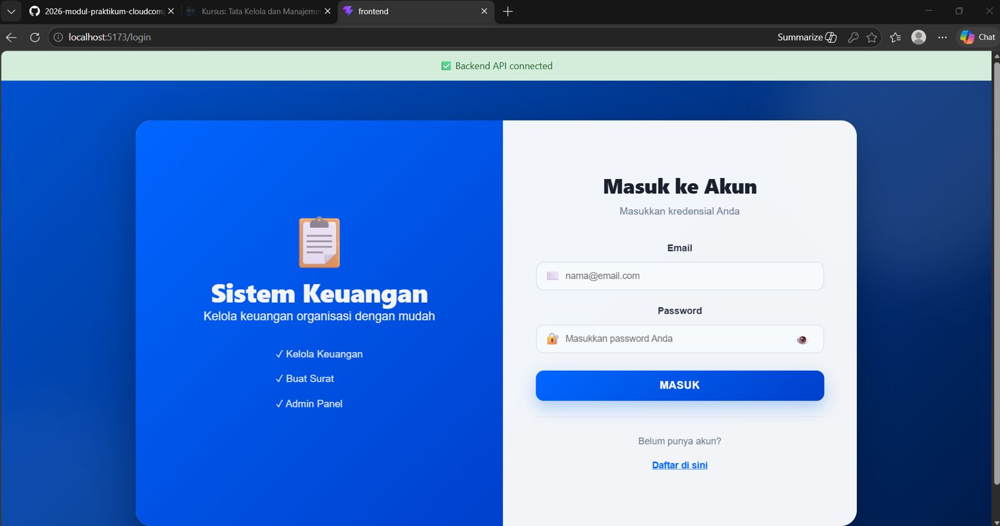
    Berdasarkan gambar tersebut menunjukkan bahwa sistem menampilkan status API Connected yang menandakan bahwa sistem telah berhasil terhubung dengan API atau frontend berhasil berkomunikasi dengan backend.

2. **Items dari Modul 2 muncul di daftar**  
    Setelah koneksi API berhasil, sistem akan mengambil data item dari database dan menampilkannya pada daftar item di halaman utama. 
    
    Berdasarkan gambar tersebut menunjukkan bahwa sistem berhasil mengambil data item dari database modul 2 dan menampilkannya pada daftar item di manajemen surat. 

3. **Tambah item baru via form**  
    Pada tahap ini, pengguna mencoba menambahkan data item baru melalui form input surat baru.
    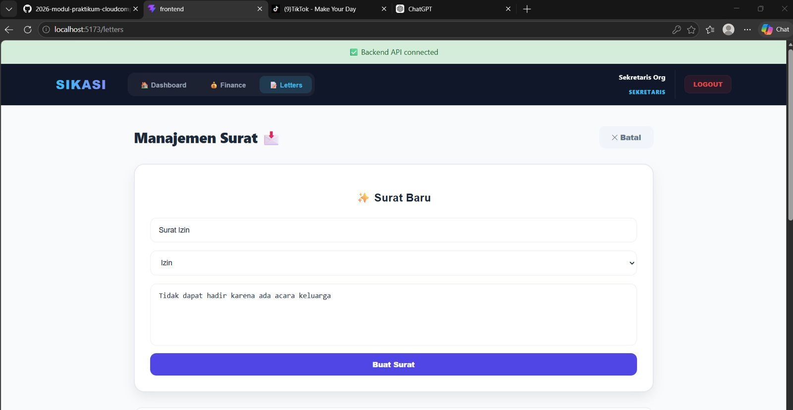
    Berdasarkan gambar tersebut, saya mencoba menambahkan item baru yaitu Surat Izin dengan jenis surat izin dan berdeskripsikan alasan berupa permohonan izin tidak dapat hadir karena ada acara keluarga. Kemudian mengklik tambah item untuk menyimpan data item tersebut dan sistem memproses permintaan penambahan item surat baru. 

4. **Item muncul di daftar**  
    Setelah permintaan penambahan item surat baru sebelumnya telah berhasil maka item tersebut akan tersimpan dalam daftar item pada sistem manajemen surat. 
    
    Berdasarkan gambar tersebut menunjukkan bahwa item surat baru berhasil ditampilkan pada daftar item yang ada pada sistem manajemen surat, item tersebut berupa Surat Izin dengan jenis surat izin dan berdeskripsikan alasan berupa permohonan izin tidak dapat hadir karena ada acara keluarga.

5. **Klik Edit pada item**  
    Pada tahap ini pengguna memilih salah satu item yang ada pada daftar dan mengklik tombol Edit untuk mengubah isi dari item tersebut.
    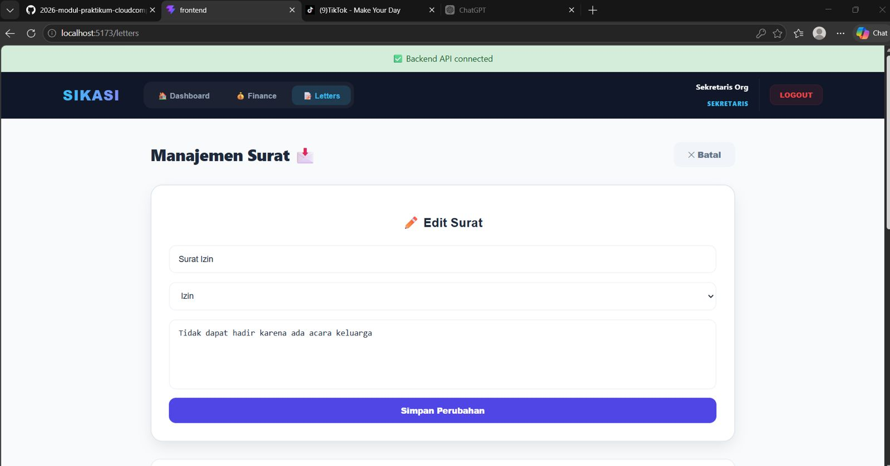
    Berdasarkan gambar tersebut, setelah saya mengklik tombol edit maka sistem menampilkan halaman edit berupa form edit dari item yang telah dipilih. Melalui halaman ini saya dapat mengubah data pada item Surat izin.

6. **Form edit terisi data lama, ubah harga dan klik update**  
    Berdasarkan gambar pada test 5 menunjukkan bahwa sistem menampilkan halaman form edit yang berisikan data lama dari item yang telah dipilih sebelumnya.
    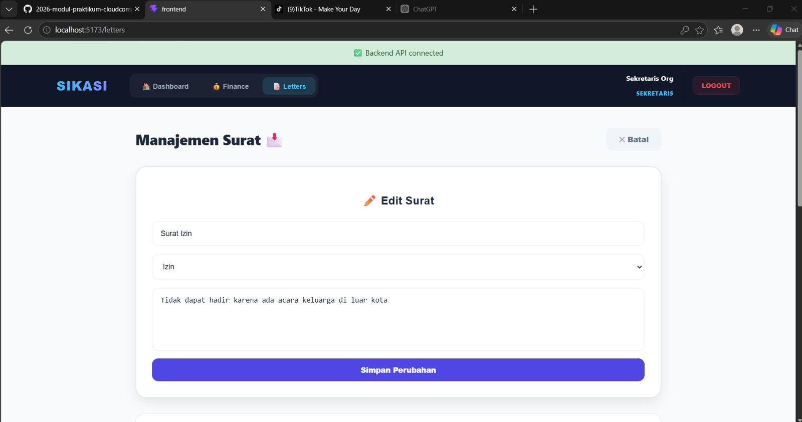
    Selanjutnya saya ingin mengubah deskripsi pada Surat Izin yang awalnya berupa permohonan izin tidak dapat hadir karena ada acara keluarga menjadi permohonan izin tidak dapat hadir karena ada acara keluarga di luar kota. Setelah selesai mengubah, klik tombol simpan perubahan agar sistem dapat mengirimkan permintaan untuk mengubah data item surat tersebut.
    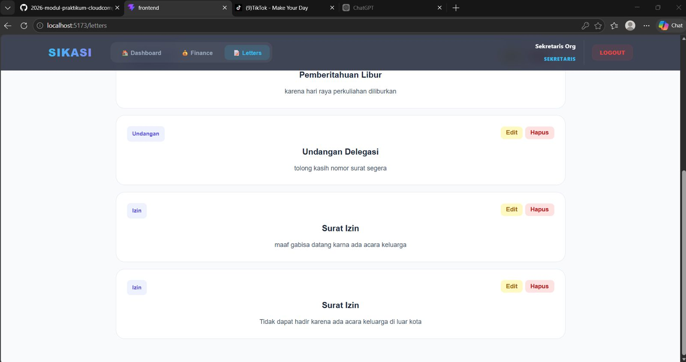
    Setelah sistem menerima permintaan pengubahan data item surat, maka item surat tersebut akan muncul pada daftar item manajemen surat.

7. **Mencari item via SearchBar**  
    Pada tahap ini pengguna mencoba menggunakan fitur SearchBar untuk memudahkan dalam pencarian item tertentu dengan memasukkan kata kunci.
    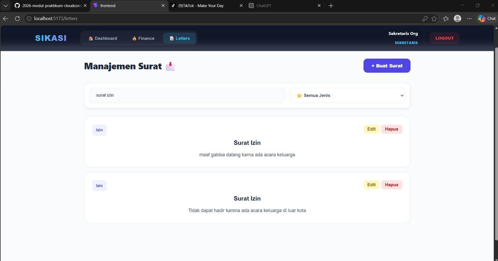
    Berdasarkan gambar tersebut, saya ingin mencari item Suart Izin menggunakan fitur SearchBar dengan memasukkan kata kunci berupa Surat Izin. Sistem akan menampilkan daftar item yang sesuai dengan kata kunci pencarian, disini saya mencari Surat Izin sehingga yang tampil pada daftar item hanya Surat Izin saja yang menandakan bahwa SearchBar berhasil dijalankan.

8. **Hapus item, confirm dialog muncul**  
    Pada tahap ini pengguna menghapus item dengan mengklik tombol delete pada item yang ingin dihapus.
    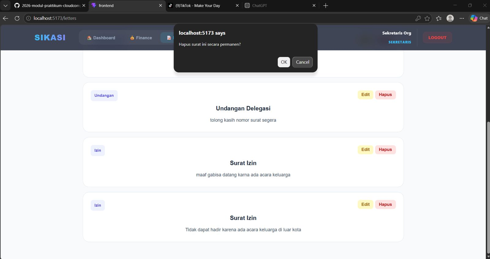
    Berdasarkan gambar tersebut, saya memilih item Surat Izin untuk dihapus dengan mengklik tombol delete dan sistem akan menampilkan sebuah konfirmasi kepada saya untuk menyetujui penghapusan pada item tersebut.

9. **Item hilang dari daftar**  
    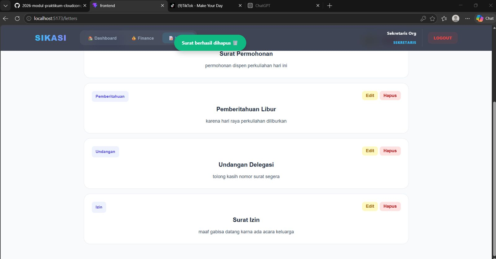
    Setelah saya menyetujui konfirmasi penghapusan item laptop, sistem akan memproses permintaan penghapusan yang telah saya kirimkan. Selanjutnya jika proses tersebut berhasil maka sistem akan memperbarui daftar item,  dimana item yang telah dipilih untuk penghapusan sebelumnya akan hilang dari daftar item.

10. **Hapus semua item, empty state muncul**  
    Pada tahap ini pengguna mencoba untuk menghapus semua item yang ada pada daftar item dalam sistem dengan mengklik tombol delete dan melakukan konfirmasi persetujuan penghapusan item. 
    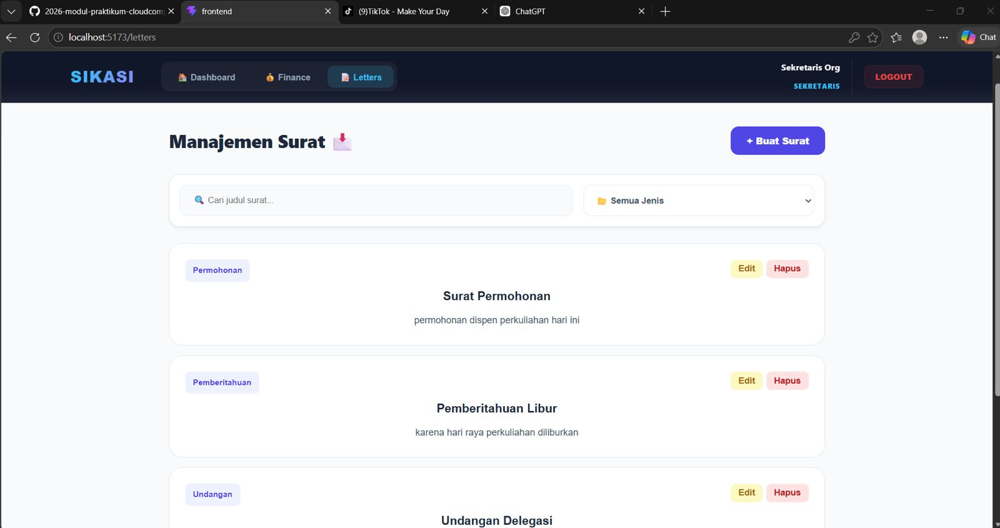
    Disini saya mencoba untuk menghapus semua item yang tersisa sebelumnya berupa surat permohonan, pemberitahuan libur, undangan delegasi, dan surat izin dengan melakukan konfirmasi persetujuan penghapusan item-item. Kemudian sistem akan memproses permintaan tersebut.
    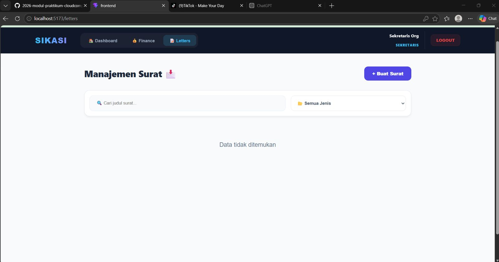
    Setelah proses penghapusan yang dilakukan sistem berhasil, maka sistem tidak akan menampilkan daftar item kembali karena item yang ada sebelumnya telah dihapus dan saat ini sistem menampilkan sebuah empty state yang menunjukkan bahwa tidak ada item dalam sistem ini. 

---

## (Tambahan) Dokumentasi Komponen Notifikasi/Toast
Penambahan fitur notifikasi/toast ini adalah untuk memberikan respon secara langsung ke pengguna ketika pengguna melakukan aktifitas menambahkan, mengedit, atau menghapus. Dengan notifikasi akan muncul secara otomatis dan menghilang otomatis dalam 3 detik. Dengan adanya fitur ini, pengguna dapat mengetahui status dari aktifitas yang dilakukan.

1. Menambahkan Items
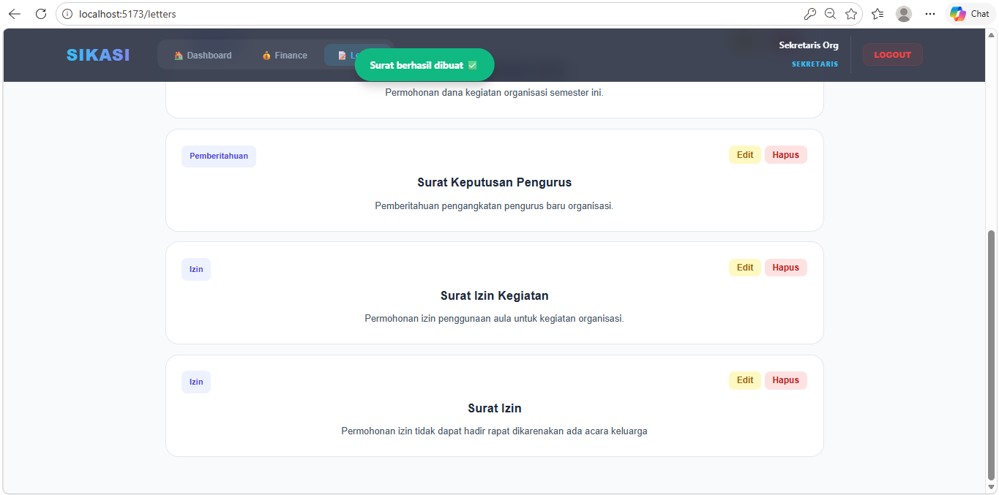
Ini dokumentasi yang menunjukkan notifikasi toast yang muncul ketika pengguna berhasil menambahkan item baru. Sistem menampilkan pesan “Item berhasil ditambahkan” sebagai tanda bahwa data telah berhasil diproses dan disimpan oleh sistem.

2. Edit Items

Ini dokumentasi yang menunjukkan notifikasi toast yang muncul setelah pengguna berhasil mengedit data item. Pesan “Item berhasil diperbarui” ditampilkan sebagai konfirmasi bahwa perubahan data telah berhasil disimpan oleh sistem.

3. Hapus Items
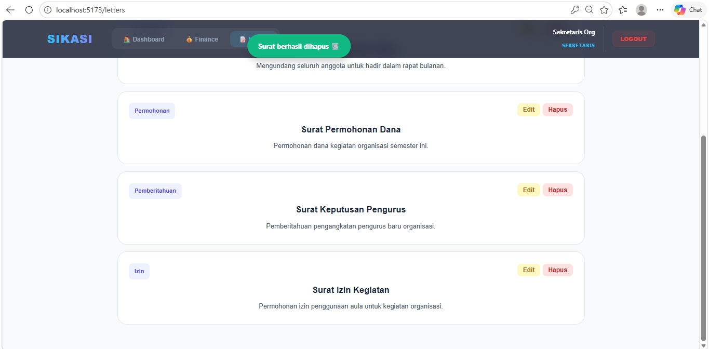
Ini dokumentasi yang menunjukkan notifikasi toast yang muncul setelah pengguna berhasil menghapus item dari daftar. Sistem menampilkan pesan “Item berhasil dihapus” sebagai konfirmasi bahwa data item telah berhasil dihapus dari sistem.