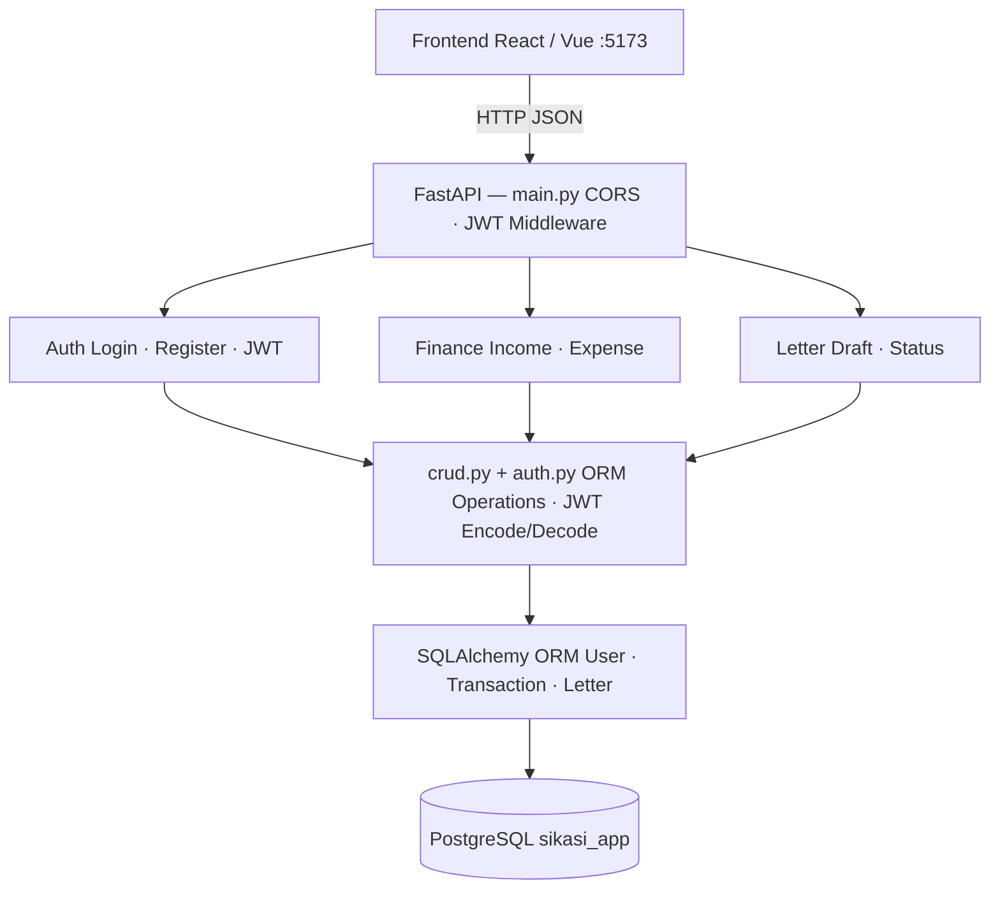

# ☁️ Cloud App - SIKASI (Sistem Informasi Keuangan dan Administrasi HMSI)

Sistem ini adalah sistem yang dirancang untuk membantu para pengurus Himpunan Mahasiswa Sistem Informasi (HMSI) dalam mengelola keuangan dan administrasi organisasi secara terintegrasi dalam satu platform. Melalui sistem ini, bendahara dapat mencatat dana masuk dan dana keluar sehingga arus kas (cash flow) dapat terpantau dan terupdate secara otomatis. Selain itu, sistem juga menyediakan fitur pengelolaan surat masuk dan surat keluar, termasuk penomoran surat serta pengelolaan tanda tangan dari Ketua Himpunan Sistem Informasi (HMSI) secara digital. Dengan demikian, seluruh data keuangan dan administrasi dapat tersimpan dengan rapi dan terstruktur.

Aplikasi ini ditujukan bagi seluruh pengurus HMSI untuk mendukung transparansi, ketertiban, dan efisiensi dalam pengelolaan organisasi. Sistem ini hadir sebagai solusi atas permasalahan pencatatan manual yang sering tidak terorganisir, sulit direkap, dan kurang transparan. Dengan adanya sistem yang terintegrasi, proses pelaporan dan administrasi menjadi lebih akurat, praktis, dan mudah diakses ketika dibutuhkan.

## 👥 Tim

| Nama | NIM | Peran |
|------|-----|-------|
| Achmad Bayhaqi | 10231001 | Lead Backend |
| Indah Nur Fortuna | 10231044 | Lead Frontend |
| Alfiani Dwiyuniarti | 10231010 | Lead DevOps |
| Zahwa Hanna Dwi Putri | 10231092 | Lead CI/CD & Deploy |
| Nilam Ayu NandaStari Romdoni | 10231070 | Lead QA & Docs |

## 🛠️ Tech Stack

| Teknologi | Fungsi | Keterangan |
|-----------|--------|------------|
| FastAPI   | Backend REST API | Membangun dan menyediakan endpoint API yang menangani proses bisnis, validasi data, dan komunikasi dengan database |
| React     | Frontend SPA | Membangun tampilan antarmuka pengguna yang interaktif dan mengonsumsi data dari backend API |
| PostgreSQL | Database | Menyimpan, mengelola, dan mengambil data aplikasi secara terstruktur |
| Docker    | Containerization | Menjalankan aplikasi dalam container agar environment development dan production tetap konsisten |
| GitHub Actions | CI/CD | Melakukan otomatisasi proses pembangunan aplikasi, pengujian, serta penerapan sistem setiap kali terjadi perubahan pada kode |
| Railway/Render | Cloud Deployment | Layanan cloud untuk mendistribusikan dan menjalankan aplikasi pada server secara online |

## 🏗️ Architecture



*(Diagram ini akan berkembang setiap minggu)*

## 🚀 Getting Started

### Prasyarat
1. **Python 3.10+** <br>
    Python digunakan untuk menjalankan sisi backend aplikasi. Pada sistem ini, backend dibangun menggunakan framework FastAPI yang berjalan di atas Python. Seluruh proses utama seperti pencatatan pemasukan, pengeluaran, setoran, pengelolaan surat, hingga pengolahan data yang terhubung ke database diproses melalui backend ini.
    
    Versi Python 3.10 atau lebih baru digunakan agar kompatibel dengan library dan fitur modern yang digunakan dalam pengembangan. Selain itu, versi terbaru juga memberikan performa yang lebih stabil dan dukungan keamanan yang lebih baik.

    Tanpa Python, backend tidak dapat dijalankan sehingga sistem tidak bisa memproses data keuangan maupun administrasi.

2. **Node.js 18+ & npm** <br>
    Node.js diperlukan untuk menjalankan sisi frontend aplikasi yang dibangun menggunakan **React** dan Vite. Frontend berfungsi sebagai antarmuka yang digunakan oleh pengurus HMSI untuk mengakses sistem melalui browser.

    Node.js digunakan untuk:
    - Mengelola dependency proyek menggunakan npm
    - Menjalankan server pengembangan (development server)
    - Melakukan proses build aplikasi sebelum deployment

    Penggunaan Node.js versi 18+ bertujuan untuk memastikan kompatibilitas dengan versi React dan tools modern yang digunakan, serta menghindari kendala error pada dependency.

    Tanpa Node.js, tampilan sistem tidak dapat dijalankan sehingga pengguna tidak dapat mengakses fitur yang tersedia.

3. **Git** <br>
    Git digunakan sebagai sistem version control dalam pengembangan proyek ini. Karena aplikasi dikembangkan secara tim, Git berperan penting untuk mengatur perubahan kode, menyimpan riwayat pengembangan, serta menghindari konflik ketika beberapa anggota bekerja pada waktu yang sama.

    Melalui Git, setiap anggota dapat melakukan commit, push, dan pull perubahan ke repository GitHub Classroom. Hal ini juga mendukung transparansi kontribusi masing-masing anggota dalam proyek. Tanpa Git, proses kolaborasi dan pengelolaan versi kode akan sulit dilakukan secara terstruktur.

    Dengan memenuhi seluruh prasyarat di atas, aplikasi SIKASI dapat dijalankan secara optimal baik pada sisi backend maupun frontend, serta mendukung proses pengembangan yang terstruktur dan kolaboratif.

4. **PostgreSQL 14+** <br>
    PostgreSQL 14+ adalah sistem manajemen basis data relasional open-source versi terbaru yang menawarkan performa lebih cepat, keamanan lebih baik, serta dukungan fitur lanjutan seperti JSON, indexing yang efisien, dan replikasi data. Versi ini cocok digunakan untuk aplikasi modern karena stabil, scalable, dan mampu menangani data dalam jumlah besar.
---

### Setup Backend
```bash
# Masuk ke Folder Backend
cd backend

# Install Dependencies
pip install -r requirements.txt

# Menjalankan Server Backend 
uvicorn main:app --reload --port 8000

# Backend Berjalan Di : http://localhost:8000

# Menjalankan Swagger UI Di : http://localhost:8000/docs
```

Backend berhasil menampilkan pesan {"message":"Hello from Sikasi App API!","status":"running","version":"0.1.0"} di browser  http://localhost:8000 dan backend juga berhasil menampilkan dokumentasi API otomatis di http://localhost:8000/docs (Swagger UI)

### Setup Frontend
```bash

# Masuk ke Folder Frondend
cd frontend

# Install Node Modules (Dependencies)
npm install

# Menjalankan Aplikasi Frontend (Development Mode)
npm run dev

# Frontend Berjalan Di : http://localhost:5173
```

Frontend berhasil menampilkan data dari backend API → koneksi full-stack

## 📅 Roadmap

Berikut adalah roadmap untuk menunjukkan progres dan milestone proyek kami:

| Minggu | Target | Status |
|--------|--------|--------|
| 1 | Setup Proyek: Menyiapkan struktur proyek, repositori GitHub, dan lingkungan pengembangan (backend dan frontend). | ✅ Completed |
| 2 | CRUD API & Database: Implementasi REST API untuk transaksi keuangan (masuk/keluar) dan surat (masuk/keluar), serta setup database PostgreSQL. | ✅ Completed |
| 3 | Frontend React Setup: Membuat tampilan antarmuka pengguna (frontend) dengan React, termasuk halaman login dan dashboard. | ✅ Completed |
| 4 | Full-Stack Integration: Menghubungkan frontend dan backend, memastikan komunikasi antara API dan frontend berjalan dengan baik. | ✅ Completed |
| 5-7 | Docker & Docker Compose: Containerisasi aplikasi dengan Docker dan setup Docker Compose untuk mengelola backend, frontend, dan database secara terpisah. | ✅ Completed |
| 8 | UTS: Persiapan dan presentasi demo untuk UTS, menampilkan implementasi awal sistem.| 🔄 In Progress |
| 9-11 | CI/CD Pipeline: Pengaturan CI/CD pipeline untuk otomatisasi testing, build, dan deployment menggunakan GitHub Actions. | ⬜ Pending |
| 12-14 | Microservices Architecture: Mengimplementasikan arsitektur microservices untuk meningkatkan skalabilitas dan modularitas aplikasi. | ⬜ Pending |
| 15-16 | Final Deployment & UAS Demo: Finalisasi aplikasi, deployment ke cloud, dan persiapan untuk presentasi demo UAS. | ⬜ Pending |

## Struktur Proyek 

Berikut adalah struktur proyek untuk aplikasi Sistem Informasi Keuangan dan Administrasi HMSI (SIKASI).

```
cc-kelompok-6/
├── backend/
│   ├── main.py                  # Main entry untuk aplikasi FastAPI (backend)
│   ├── requirements.txt         # Daftar dependencies untuk backend
│   ├── models/                  # Model database
│   ├── services/                # Layanan untuk logika bisnis dan API
│   └── config/                  # Konfigurasi aplikasi (misalnya, pengaturan database)
│
├── frontend/
│   ├── public/                  # File statis seperti gambar dan favicon
│   ├── src/                     # Kode sumber aplikasi React
│   │   ├── components/          # Komponen UI aplikasi
│   │   ├── assets/              # Gambar dan file lainnya untuk frontend
│   │   ├── App.css              # Styling global untuk aplikasi
│   │   ├── App.jsx              # Komponen utama untuk aplikasi React
│   │   ├── index.css            # Styling CSS tambahan
│   │   └── main.jsx             # Entry point untuk aplikasi React
│   ├── package.json             # Dependencies dan pengaturan untuk frontend
│   └── vite.config.js           # Konfigurasi untuk build dan development frontend
│
├── docs/                        # Dokumentasi tim dan proyek
│   ├── member-Achmad-Bayhaqi.md
│   ├── member-Alfiani-Dwiyuniarti.md
│   ├── member-Indah-Nur-Fortuna.md
│   ├── member-Nilam-Ayu-NandaStari-Romdoni.md
│   ├── member-Zahwa-Hanna-Dwi-Putri.md
│   └── README.md                # Dokumentasi utama proyek, roadmap, dll.
│
├── .gitignore                   # File untuk mengabaikan file tertentu dalam Git
├── README.md                    # Dokumentasi utama proyek
```

## Deployment

Aplikasi SIKASI (Sistem Informasi Keuangan dan Administrasi) ini akan dideploy menggunakan platform cloud seperti Railway atau Render agar dapat diakses secara online oleh seluruh pengurus HMSI.

Deployment akan dilakukan secara otomatis menggunakan CI/CD pipeline dengan GitHub Actions.

### Alur Deployment
Setiap perubahan kode yang di push ke repository akan melalui proses berikut:
1. Code di-push ke GitHub
2. GitHub Actions menjalankan proses build dan testing
3. Jika berhasil, aplikasi akan otomatis dideploy ke cloud
4. Aplikasi dapat diakses secara online

### Tujuan Deployment
1. Memastikan sistem dapat diakses kapan saja oleh pengurus HMSI
2. Mendukung transparansi data keuangan dan administrasi secara real-time
3. Mengurangi penggunaan sistem manual

### Status
Sekarang ini deployment masih dalam tahap perencanaan (akan diimplementasikan pada minggu 9–11 sesuai roadmap mata kuliah).

### Catatan
Backend (FastAPI) disini akan menjadi pusat pengolahan data keuangan dan administrasi, sedangkan frontend nya(React) akan menjadi antarmuka pengguna.

Database akan digunakan untuk menyimpan:
- Data pemasukan dan pengeluaran
- Data surat masuk dan keluar
- Data pengurus HMSI

Semua layanan ini nantinya akan dideploy secara terintegrasi di cloud.


---

## 📡 API Documentation

### 1️⃣ POST /letters
Endpoint ini digunakan untuk menambahkan item baru ke dalam sistem inventory.<p>
**Method** <br>
```
POST
```
**URL**
```
http://localhost:8000/letters
```
**Request Body** <p>
Item 1 : 
```
{
    "title": "keluar",
    "letter_type": "Leave Request",
    "content": gapapa"
}
```
Item 2 : 
```
{
    "title": "gak sesuai",
    "letter_type": "Complaint",
    "content": berbeda aja"
}
```
Item 3 : 
```
{
    "title": "surat izin",
    "letter_type": "Other",
    "content": ada acara"
}
```

**Response Body** <p>
Item 1 :
```
{
    "content": "gapapa"
    "id": 4,
    "created_at": "2026-04-11T13:58:01.703590",
    "letter_type": "Leave Request",
    "status": "draft",
    "title": "keluar",
    "update_at": "2026-04-11T13:58:01.703590"
}
```

Item 2 :
```
{
    "content": "berbeda aja"
    "id": 5,
    "created_at": "2026-04-11T14:58:01.818530",
    "letter_type": "Complaint",
    "status": "draft",
    "title": "ga sesuai",
    "update_at": "2026-04-11T14:58:01.818530"
}
```

Item 3 :
```
{
    "content": "ada acara"
    "id": 6,
    "created_at": "2026-04-11T14:01:30.467232",
    "letter_type": "Other",
    "status": "draft",
    "title": "surat izin",
    "update_at": "2026-04-11T14:01:30.467232"
}
```


### 2️⃣ GET /letters
Endpoint ini digunakan untuk mengambil seluruh daftar item yang tersimpan di dalam sistem inventory. Biasanya digunakan ketika pengguna ingin melihat semua item yang tersedia di database.<p>

**Method** <br>
```
GET
```
**URL**
```
http://localhost:8000/letters?skip=0&limit=3
```
**Request Body** <p>
Endpoint ini tidak memerlukan request body karena hanya digunakan untuk mengambil daftar item.

**Response Body** <p>
```
[
    {
        "content": "gapapa"
        "id": 4,
        "created_at": "2026-04-11T13:58:01.703590",
        "letter_type": "Leave Request",
        "status": "draft",
        "title": "keluar",
        "update_at": "2026-04-11T13:58:01.703590"
    },
    {
        "content": "berbeda aja"
        "id": 5,
        "created_at": "2026-04-11T14:58:01.818530",
        "letter_type": "Complaint",
        "status": "draft",
        "title": "ga sesuai",
        "update_at": "2026-04-11T14:58:01.818530"
    },
    {
        "content": "ada acara"
        "id": 6,
        "created_at": "2026-04-11T14:01:30.467232",
        "letter_type": "Other",
        "status": "draft",
        "title": "surat izin",
        "update_at": "2026-04-11T14:01:30.467232"
    }
]
```

### 3️⃣ GET /letters/{letter_id}
Endpoint ini digunakan untuk mengambil data satu item tertentu berdasarkan ID dan biasanya digunakan ketika pengguna ingin melihat detail dari satu item secara spesifik.

**Method** <br>
```
GET 
```
**URL**
```
http://localhost:8000/letters/6
```
**Request Body** <p>
Endpoint ini tidak memerlukan request body karena hanya digunakan untuk mengambil daftar item.

**Response Body** <p>
```
{
    "content": "ada acara"
    "id": 6,
    "created_at": "2026-04-11T14:01:30.467232",
    "letter_type": "Other",
    "status": "draft",
    "title": "surat izin",
    "update_at": "2026-04-11T14:01:30.467232"
}
```

### 4️⃣ PUT /letter/{letter_id}
Endpoint ini digunakan untuk memperbarui data item yang sudah ada di dalam sistem inventory berdasarkan ID item. <p>

**Method** <br>
```
PUT 
```
**URL**
```
http://localhost:8000/letters/6
```
**Request Body** <p>
```
{
    "title": "surat izin",
    "letter_type": "Other",
    "content": ada acara di luar kota"
}
```

**Response Body** <p>
```
{
    "content": "ada acara di luar kota"
    "id": 6,
    "created_at": "2026-04-11T14:01:30.467232",
    "letter_type": "Other",
    "status": "draft",
    "title": "surat izin",
    "update_at": "2026-04-11T14:16:18.743361"
}
```

### 5️⃣ GET /letters/{letter_id}
Endpoint ini kembali dijalankan untuk mengambil data satu item tertentu berdasarkan ID dan melihat perubahan data yang telah diubah.

**Method** <br>
```
GET 
```
**URL**
```
http://localhost:8000/letters/6
```
**Request Body** <p>
```
{
    "content": "ada acara di luar kota"
    "id": 6,
    "created_at": "2026-04-11T14:01:30.467232",
    "letter_type": "Other",
    "status": "draft",
    "title": "surat izin",
    "update_at": "2026-04-11T14:16:18.743361"
}
```

### 6️⃣ DELETE /letters/{letter_id}
Endpoint ini digunakan untuk menghapus item tertentu dari sistem inventory berdasarkan ID.
Ketika endpoint ini dipanggil, sistem akan mencari item yang memiliki ID sesuai dan kemudian menghapusnya dari database.

**Method** <br>
```
DELETE 
```
**URL**
```
http://localhost:8000/letters/6
```
**Request Body** <p>
Endpoint ini tidak memerlukan request body karena hanya membutuhkan ID item pada URL.

**Response Body** <p>
```
{
    "detail": "Letter deleted"
}
```

### 7️⃣ GET /letters/{letter_id}
Endpoint ini kembali dijalankan untuk mengambil data satu item tertentu berdasarkan ID dan melihat response data yang telah dihapus dengan menampilkan 404 Not Found.

**Method** <br>
```
GET 
```
**URL**
```
http://localhost:8000/letters/6
```
**Request Body** <p>
```
{
    "content": "ada acara di luar kota"
    "id": 6,
    "created_at": "2026-04-11T14:01:30.467232",
    "letter_type": "Other",
    "status": "draft",
    "title": "surat izin",
    "update_at": "2026-04-11T14:16:18.743361"
}
```

**Response Body** <p>
```
{
    "detail": "Letter not found"
}
```
---

## 🔐 Authentication

### 🌐 Public Endpoints <br>
Public endpoints adalah endpoint yang dapat diakses tanpa autentikasi (tanpa token). Endpoint ini biasanya digunakan untuk proses awal seperti registrasi, login, atau pengecekan status API. <p>

| Method | Endpoint       | Deskripsi                     |
| ------ | -------------- | ----------------------------- |
| GET    | /              | Root endpoint (cek API jalan) |
| GET    | /health        | Cek status API                |
| GET    | /team          | Informasi tim                 |


### 🔐 Authentication Endpoints
Authentication endpoints adalah endpoint yang digunakan untuk proses autentikasi pengguna seperti registrasi, login, dan pengelolaan token. Endpoint ini memungkinkan pengguna untuk mendapatkan akses ke sistem.
| Method | Endpoint       | Deskripsi                   |
| ------ | -------------- | --------------------------- |
| POST   | /auth/register | Register user baru          |
| POST   | /auth/login    | Login user                  |
| POST   | /auth/refresh  | Refresh access token        |
| GET    | /auth/me       | Mendapatkan data user login |

### 💰 Finance Endpoints
Finance endpoints adalah endpoint yang digunakan untuk mengelola data keuangan seperti transaksi dan ringkasan keuangan. Endpoint ini biasanya memerlukan autentikasi.
| Method | Endpoint                               | Deskripsi                   |
| ------ | -------------------------------------- | --------------------------- |
| POST   | /finance/transactions                  | Membuat transaksi baru      |
| GET    | /finance/transactions                  | Menampilkan semua transaksi |
| GET    | /finance/transactions/{transaction_id} | Detail transaksi            |
| PUT    | /finance/transactions/{transaction_id} | Update transaksi            |
| DELETE | /finance/transactions/{transaction_id} | Hapus transaksi             |
| GET    | /finance/summary                       | Ringkasan keuangan          |


### 📄 Letters Endpoints
Letters endpoints adalah endpoint yang digunakan untuk mengelola surat, termasuk proses pembuatan, pengeditan, serta alur persetujuan (workflow) seperti submit, approve, dan reject.
| Method | Endpoint                     | Deskripsi               |
| ------ | ---------------------------- | ----------------------- |
| POST   | /letters                     | Membuat surat baru      |
| GET    | /letters                     | Menampilkan semua surat |
| GET    | /letters/{letter_id}         | Detail surat            |
| PUT    | /letters/{letter_id}         | Update surat            |
| DELETE | /letters/{letter_id}         | Hapus surat             |
| POST   | /letters/{letter_id}/submit  | Submit surat            |
| POST   | /letters/{letter_id}/approve | Approve surat           |
| POST   | /letters/{letter_id}/reject  | Reject surat            |


### 👥 Users Endpoints
Users endpoints adalah endpoint yang digunakan untuk mengelola data pengguna, termasuk pembuatan, melihat, memperbarui, dan menghapus user dalam sistem.
| Method | Endpoint         | Deskripsi                      |
| ------ | ---------------- | ------------------------------ |
| POST   | /users           | Membuat user baru (oleh ketua) |
| GET    | /users           | Menampilkan semua user         |
| GET    | /users/{user_id} | Detail user                    |
| PUT    | /users/{user_id} | Update user                    |
| DELETE | /users/{user_id} | Hapus user                     |

### ⚠️ Error Handling
| Status Code | Deskripsi                              |
| ----------- | -------------------------------------- |
| 200         | Berhasil                               |
| 201         | Data berhasil dibuat                   |
| 400         | Request tidak valid                    |
| 401         | Unauthorized (token tidak ada / salah) |
| 403         | Forbidden (tidak punya akses)          |
| 404         | Data tidak ditemukan                   |
| 500         | Internal server error                  |
