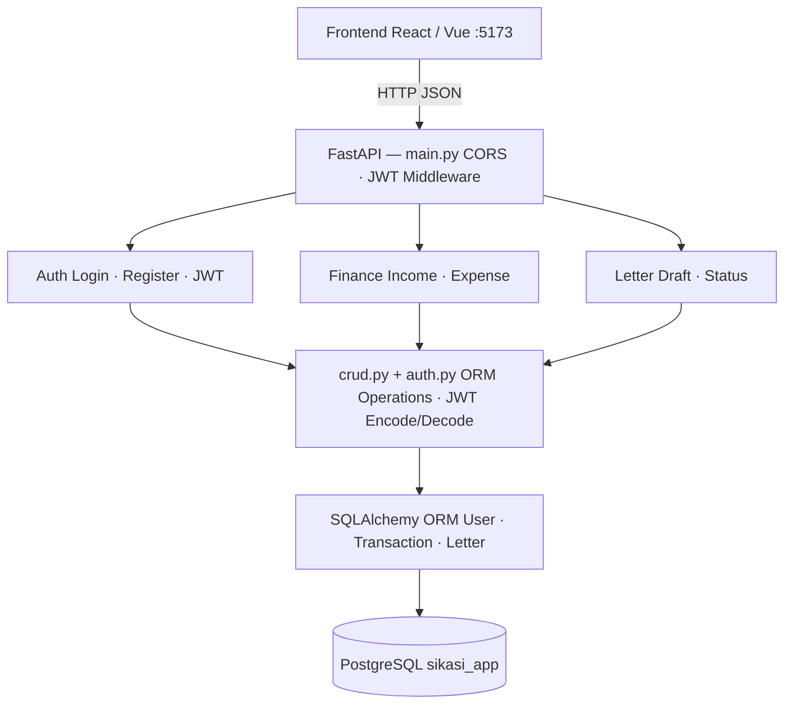

# ☁️ Cloud App - SIKASI (Sistem Informasi Keuangan dan Administrasi HMSI)

Deskripsi singkat aplikasi (1-2 paragraf): apa yang dilakukan, 
untuk siapa, masalah apa yang diselesaikan.

## 👥 Tim

| Nama | NIM | Peran |
|------|-----|-------|
| ...  | ... | Lead Backend |
| ...  | ... | Lead Frontend |
| ...  | ... | Lead DevOps |
| ...  | ... | Lead QA & Docs |

## 🛠️ Tech Stack

| Teknologi | Fungsi | Keterangan |
|-----------|--------|------------|
| FastAPI   | Backend REST API | Membangun dan menyediakan endpoint API yang menangani proses bisnis, validasi data, dan komunikasi dengan database |
| React     | Frontend SPA | Membangun tampilan antarmuka pengguna yang interaktif dan mengonsumsi data dari backend API |
| PostgreSQL | Database | Menyimpan, mengelola, dan mengambil data aplikasi secara terstruktur |
| Docker    | Containerization | Menjalankan aplikasi dalam container agar environment development dan production tetap konsisten |
| GitHub Actions | CI/CD | Melakukan otomatisasi proses pembangunan aplikasi, pengujian, serta penerapan sistem setiap kali terjadi perubahan pada kode |
| Railway/Render | Cloud Deployment | Layanan cloud untuk mendistribusikan dan menjalankan aplikasi pada server secara online |

## 🏗️ Architecture



*(Diagram ini akan berkembang setiap minggu)*

## 🚀 Getting Started

### Prasyarat
* Python 3.10+
* Node.js 18+ & npm
* Git
* PostgreSQL 14+

### Setup Backend
```bash

# Masuk ke Folder Backend
cd backend

# Install Dependencies
pip install -r requirements.txt

# Menjalankan Server Backend 
uvicorn main:app --reload --port 8000

# Backend Berjalan Di : http://localhost:8000

# Menjalankan Swagger UI Di : http://localhost:8000/docs
```

Backend berhasil menampilkan pesan {"message":"Hello from Sikasi App API!","status":"running","version":"0.1.0"} di browser  http://localhost:8000 dan backend juga berhasil menampilkan dokumentasi API otomatis di http://localhost:8000/docs (Swagger UI)

### Setup Frontend
```bash

# Masuk ke Folder Frondend
cd frontend

# Install Node Modules (Dependencies)
npm install

# Menjalankan Aplikasi Frontend (Development Mode)
npm run dev

# Frontend Berjalan Di : http://localhost:5173
```

Frontend berhasil menampilkan data dari backend API → koneksi full-stack

## 📅 Roadmap

Berikut adalah roadmap untuk menunjukkan progres dan milestone proyek kami:

| Minggu | Target | Status |
|--------|--------|--------|
| 1 | Setup Proyek: Menyiapkan struktur proyek, repositori GitHub, dan lingkungan pengembangan (backend dan frontend). | ✅ Completed |
| 2 | CRUD API & Database: Implementasi REST API untuk transaksi keuangan (masuk/keluar) dan surat (masuk/keluar), serta setup database PostgreSQL. | 🔄 In Progress |
| 3 | Frontend React Setup: Membuat tampilan antarmuka pengguna (frontend) dengan React, termasuk halaman login dan dashboard. | ⬜ Pending |
| 4 | Full-Stack Integration: Menghubungkan frontend dan backend, memastikan komunikasi antara API dan frontend berjalan dengan baik. | ⬜ Pending |
| 5-7 | Docker & Docker Compose: Containerisasi aplikasi dengan Docker dan setup Docker Compose untuk mengelola backend, frontend, dan database secara terpisah. | ⬜ Pending |
| 8 | UTS: Persiapan dan presentasi demo untuk UTS, menampilkan implementasi awal sistem.| ⬜ Pending |
| 9-11 | CI/CD Pipeline: Pengaturan CI/CD pipeline untuk otomatisasi testing, build, dan deployment menggunakan GitHub Actions. | ⬜ Pending |
| 12-14 | Microservices Architecture: Mengimplementasikan arsitektur microservices untuk meningkatkan skalabilitas dan modularitas aplikasi. | ⬜ Pending |
| 15-16 | Final Deployment & UAS Demo: Finalisasi aplikasi, deployment ke cloud, dan persiapan untuk presentasi demo UAS. | ⬜ Pending |

## Struktur Proyek 

Berikut adalah struktur proyek untuk aplikasi Sistem Informasi Keuangan dan Administrasi HMSI (SIKASI). Proyek ini memiliki dua komponen utama, yaitu frontend dan backend yang bekerja secara terpisah namun saling terhubung melalui API. Semua file yang terkait dengan pengembangan aplikasi ini terorganisir dengan rapi di dalam folder-folder yang sesuai. Struktur berikut mencerminkan pembagian tanggung jawab antar tim dalam proyek, serta memudahkan pengelolaan, pengembangan, dan deployment aplikasi.

```
cc-kelompok-6/
├── backend/
│   ├── main.py                  # Main entry untuk aplikasi FastAPI (backend)
│   ├── requirements.txt         # Daftar dependencies untuk backend
│   ├── models/                  # Model database
│   ├── services/                # Layanan untuk logika bisnis dan API
│   └── config/                  # Konfigurasi aplikasi (misalnya, pengaturan database)
│
├── frontend/
│   ├── public/                  # File statis seperti gambar dan favicon
│   ├── src/                     # Kode sumber aplikasi React
│   │   ├── components/          # Komponen UI aplikasi
│   │   ├── assets/              # Gambar dan file lainnya untuk frontend
│   │   ├── App.css              # Styling global untuk aplikasi
│   │   ├── App.jsx              # Komponen utama untuk aplikasi React
│   │   ├── index.css            # Styling CSS tambahan
│   │   └── main.jsx             # Entry point untuk aplikasi React
│   ├── package.json             # Dependencies dan pengaturan untuk frontend
│   └── vite.config.js           # Konfigurasi untuk build dan development frontend
│
├── docs/                        # Dokumentasi tim dan proyek
│   ├── member-Achmad-Bayhaqi.md
│   ├── member-Alfiani-Dwiyuniarti.md
│   ├── member-Indah-Nur-Fortuna.md
│   ├── member-Nilam-Ayu-NandaStari-Romdoni.md
│   ├── member-Zahwa-Hanna-Dwi-Putri.md
│   └── README.md                # Dokumentasi utama proyek, roadmap, dll.
│
├── .gitignore                   # File untuk mengabaikan file tertentu dalam Git
├── README.md                    # Dokumentasi utama proyek
```

### Penjelasan Struktur Proyek:
- Backend: Folder ini berisi kode sumber untuk backend yang menggunakan FastAPI. Terdapat berbagai file seperti main.py yang menjadi entry point, requirements.txt untuk mengelola dependencies, dan folder models serta services untuk logika dan pengolahan data.
- Frontend: Folder ini berisi kode untuk tampilan aplikasi yang dibangun menggunakan React. Semua komponen, styling, dan logika tampilan berada di dalam folder src. package.json digunakan untuk mengelola dependensi frontend, dan vite.config.js adalah konfigurasi untuk build aplikasi.
- Docs: Folder ini berisi dokumentasi anggota tim dan deskripsi tentang proyek, termasuk README.md yang menjelaskan keseluruhan aplikasi serta langkah-langkah pengembangan dan penggunaan.
- .gitignore: Menentukan file-file yang tidak perlu dipantau oleh Git, seperti file konfigurasi lokal atau file build.

Ini adalah gambaran umum dari struktur proyek yang dapat membantu dalam memahami pengorganisasian dan alur kerja proyek SIKASI.

## Deployment

Aplikasi SIKASI (Sistem Informasi Keuangan dan Administrasi) ini akan dideploy menggunakan platform cloud seperti Railway atau Render agar dapat diakses secara online oleh seluruh pengurus HMSI.

Deployment akan dilakukan secara otomatis menggunakan CI/CD pipeline dengan GitHub Actions.

### Alur Deployment
Setiap perubahan kode yang di push ke repository akan melalui proses berikut:
1. Code di-push ke GitHub
2. GitHub Actions menjalankan proses build dan testing
3. Jika berhasil, aplikasi akan otomatis dideploy ke cloud
4. Aplikasi dapat diakses secara online

### Tujuan Deployment
1. Memastikan sistem dapat diakses kapan saja oleh pengurus HMSI
2. Mendukung transparansi data keuangan dan administrasi secara real-time
3. Mengurangi penggunaan sistem manual

### Status
Sekarang ini deployment masih dalam tahap perencanaan (akan diimplementasikan pada minggu 9–11 sesuai roadmap mata kuliah).

### Catatan
Backend (FastAPI) disini akan menjadi pusat pengolahan data keuangan dan administrasi, sedangkan frontend nya(React) akan menjadi antarmuka pengguna.

Database akan digunakan untuk menyimpan:
- Data pemasukan dan pengeluaran
- Data surat masuk dan keluar
- Data pengurus HMSI

Semua layanan ini nantinya akan dideploy secara terintegrasi di cloud.