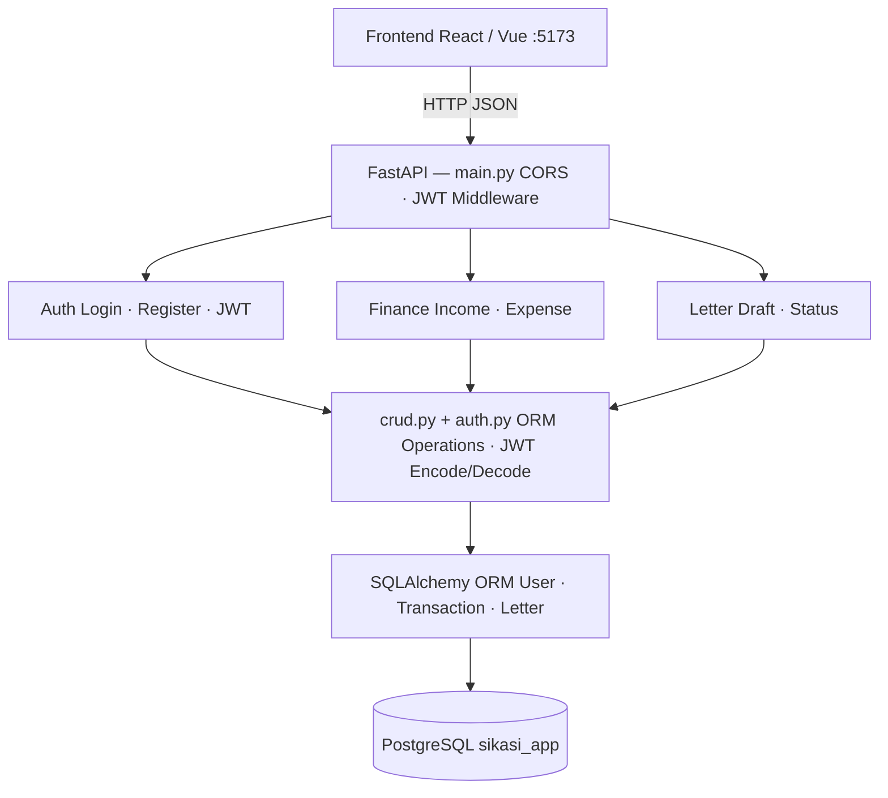

# ☁️ Cloud App - SIKASI (Sistem Informasi Keuangan dan Administrasi HMSI)


 

Sistem ini adalah sistem yang dirancang untuk membantu para pengurus Himpunan Mahasiswa Sistem Informasi (HMSI) dalam mengelola keuangan dan administrasi organisasi secara terintegrasi dalam satu platform. Melalui sistem ini, bendahara dapat mencatat dana masuk dan dana keluar sehingga arus kas (cash flow) dapat terpantau dan terupdate secara otomatis. Selain itu, sistem juga menyediakan fitur pengelolaan surat masuk dan surat keluar, termasuk penomoran surat serta pengelolaan tanda tangan dari Ketua Himpunan Sistem Informasi (HMSI) secara digital. Dengan demikian, seluruh data keuangan dan administrasi dapat tersimpan dengan rapi dan terstruktur.

Aplikasi ini ditujukan bagi seluruh pengurus HMSI untuk mendukung transparansi, ketertiban, dan efisiensi dalam pengelolaan organisasi. Sistem ini hadir sebagai solusi atas permasalahan pencatatan manual yang sering tidak terorganisir, sulit direkap, dan kurang transparan. Dengan adanya sistem yang terintegrasi, proses pelaporan dan administrasi menjadi lebih akurat, praktis, dan mudah diakses ketika dibutuhkan.

---

## 🌐 Live Demo
| Service | URL |
|---------|-----|
| Frontend | [https://sikasi-frontend-production-5f57.up.railway.app](https://sikasi-frontend-production-5f57.up.railway.app) |
| Backend API | [https://sikasi-backend-production-a11c.up.railway.app](https://sikasi-backend-production-a11c.up.railway.app) |
| API Docs (Swagger) | [https://sikasi-backend-production.up.railway.app/docs](https://sikasi-backend-production.up.railway.app/docs) |

---

## 👥 Tim

| Nama | NIM | Peran |
|------|-----|-------|
| Achmad Bayhaqi | 10231001 | Lead Backend |
| Indah Nur Fortuna | 10231044 | Lead Frontend |
| Alfiani Dwiyuniarti | 10231010 | Lead DevOps |
| Zahwa Hanna Dwi Putri | 10231092 | Lead CI/CD & Deploy |
| Nilam Ayu NandaStari Romdoni | 10231070 | Lead QA & Docs |

---

## 🛠️ Tech Stack

| Teknologi | Fungsi | Keterangan |
|-----------|--------|------------|
| FastAPI   | Backend REST API | Membangun dan menyediakan endpoint API yang menangani proses bisnis, validasi data, dan komunikasi dengan database |
| React     | Frontend SPA | Membangun tampilan antarmuka pengguna yang interaktif dan mengonsumsi data dari backend API |
| PostgreSQL | Database | Menyimpan, mengelola, dan mengambil data aplikasi secara terstruktur |
| Docker    | Containerization | Menjalankan aplikasi dalam container agar environment development dan production tetap konsisten |
| GitHub Actions | CI/CD | Melakukan otomatisasi proses pembangunan aplikasi, pengujian, serta penerapan sistem setiap kali terjadi perubahan pada kode |
| Railway/Render | Cloud Deployment | Layanan cloud untuk mendistribusikan dan menjalankan aplikasi pada server secara online |

---

## 🏗️ Architecture


```mermaid
flowchart TD
    A[Frontend React / Vue :5173] -->|HTTP JSON| B[FastAPI — main.py CORS · JWT Middleware]

    B --> C[Auth Login · Register · JWT]
    B --> D[Finance Income · Expense]
    B --> E[Letter Draft · Status]

    C --> F[crud.py + auth.py ORM Operations · JWT Encode/Decode]
    D --> F
    E --> F

    F --> G[SQLAlchemy ORM User · Transaction · Letter]
    G --> H[(PostgreSQL sikasi_app)]
```

---

## 🚀 Getting Started

### Prasyarat
1. **Python 3.10+** <br>
    Python digunakan untuk menjalankan sisi backend aplikasi. Pada sistem ini, backend dibangun menggunakan framework FastAPI yang berjalan di atas Python. Seluruh proses utama seperti pencatatan pemasukan, pengeluaran, setoran, pengelolaan surat, hingga pengolahan data yang terhubung ke database diproses melalui backend ini.
    
    Versi Python 3.10 atau lebih baru digunakan agar kompatibel dengan library dan fitur modern yang digunakan dalam pengembangan. Selain itu, versi terbaru juga memberikan performa yang lebih stabil dan dukungan keamanan yang lebih baik.

    Tanpa Python, backend tidak dapat dijalankan sehingga sistem tidak bisa memproses data keuangan maupun administrasi.

2. **Node.js 18+ & npm** <br>
    Node.js diperlukan untuk menjalankan sisi frontend aplikasi yang dibangun menggunakan **React** dan Vite. Frontend berfungsi sebagai antarmuka yang digunakan oleh pengurus HMSI untuk mengakses sistem melalui browser.

    Node.js digunakan untuk:
    - Mengelola dependency proyek menggunakan npm
    - Menjalankan server pengembangan (development server)
    - Melakukan proses build aplikasi sebelum deployment

    Penggunaan Node.js versi 18+ bertujuan untuk memastikan kompatibilitas dengan versi React dan tools modern yang digunakan, serta menghindari kendala error pada dependency.

    Tanpa Node.js, tampilan sistem tidak dapat dijalankan sehingga pengguna tidak dapat mengakses fitur yang tersedia.

3. **Git** <br>
    Git digunakan sebagai sistem version control dalam pengembangan proyek ini. Karena aplikasi dikembangkan secara tim, Git berperan penting untuk mengatur perubahan kode, menyimpan riwayat pengembangan, serta menghindari konflik ketika beberapa anggota bekerja pada waktu yang sama.

    Melalui Git, setiap anggota dapat melakukan commit, push, dan pull perubahan ke repository GitHub Classroom. Hal ini juga mendukung transparansi kontribusi masing-masing anggota dalam proyek. Tanpa Git, proses kolaborasi dan pengelolaan versi kode akan sulit dilakukan secara terstruktur.

    Dengan memenuhi seluruh prasyarat di atas, aplikasi SIKASI dapat dijalankan secara optimal baik pada sisi backend maupun frontend, serta mendukung proses pengembangan yang terstruktur dan kolaboratif.

4. **PostgreSQL 14+** <br>
    PostgreSQL 14+ adalah sistem manajemen basis data relasional open-source versi terbaru yang menawarkan performa lebih cepat, keamanan lebih baik, serta dukungan fitur lanjutan seperti JSON, indexing yang efisien, dan replikasi data. Versi ini cocok digunakan untuk aplikasi modern karena stabil, scalable, dan mampu menangani data dalam jumlah besar.

---
## 📅 Roadmap

Berikut adalah roadmap untuk menunjukkan progres dan milestone proyek kami:

| Minggu | Target | Status |
|--------|--------|--------|
| 1 | Setup Proyek: Menyiapkan struktur proyek, repositori GitHub, dan lingkungan pengembangan (backend dan frontend). | ✅ |
| 2 | CRUD API & Database: Implementasi REST API untuk transaksi keuangan (masuk/keluar) dan surat (masuk/keluar), serta setup database PostgreSQL. | ✅ |
| 3 | Frontend React Setup: Membuat tampilan antarmuka pengguna (frontend) dengan React, termasuk halaman login dan dashboard. | ✅ |
| 4 | Full-Stack Integration: Menghubungkan frontend dan backend, memastikan komunikasi antara API dan frontend berjalan dengan baik. | ✅ |
| 5-7 | Docker & Docker Compose: Containerisasi aplikasi dengan Docker dan setup Docker Compose untuk mengelola backend, frontend, dan database secara terpisah. | ✅ |
| 8 | UTS: Persiapan dan presentasi demo untuk UTS, menampilkan implementasi awal sistem.| ✅ |
| 9-11 | CI/CD Pipeline: Pengaturan CI/CD pipeline untuk otomatisasi testing, build, dan deployment menggunakan GitHub Actions. | ✅ |
| 12-14 | Microservices Architecture: Mengimplementasikan arsitektur microservices untuk meningkatkan skalabilitas dan modularitas aplikasi. | ⬜ |
| 15-16 | Final Deployment & UAS Demo: Finalisasi aplikasi, deployment ke cloud, dan persiapan untuk presentasi demo UAS. | ⬜ |

---

## Struktur Proyek 

Berikut adalah struktur proyek untuk aplikasi Sistem Informasi Keuangan dan Administrasi HMSI (SIKASI).

```
cc-kelompok-6/
├── backend/
│   ├── __pycache__/
│   ├── scripts/
│   │   ├── run.sh
│   │   ├── seed_db.py
│   │   ├── setup.sh
│   ├── tests/
│   │   ├── __pycache__/
│   │   ├── conftest.py
│   │   ├── test_auth_unit.py
│   │   ├── test_auth.py
│   │   ├── test_crud_user.py
│   │   ├── test_finance.py
│   │   ├── test_letters.py
│   │   ├── test_public.py
│   │   └── test_users.py
│   │   
│   ├── .dockerignore
│   ├── .env.docker
│   ├── .env.docker.example
│   ├── .env.example
│   ├── auth.py
│   ├── crud.py
│   ├── database.py
│   ├── Dockerfile
│   ├── main.py
│   ├── models.py
│   ├── pytest.ini
│   ├── requirements.txt
│   ├── role_dependencies.py
│   ├── schemas.py
│   └── test.db
│
├── frontend/
│   ├── node_modules/
│   ├── public/
│   ├── src/
│   │   ├── assets/
│   │   ├── components/
│   │   │   ├── __tests__/
│   │   │   ├── AdminPanel.jsx
│   │   │   ├── DarkmodeToggle.jsx
│   │   │   ├── Dashboard.jsx
│   │   │   ├── ErrorBoundary.jsx
│   │   │   ├── FinancePage.jsx
│   │   │   ├── Header.jsx
│   │   │   ├── ItemCard.jsx
│   │   │   ├── ItemForm.jsx
│   │   │   ├── ItemList.jsx
│   │   │   ├── LettersPage.jsx
│   │   │   ├── LoginPage.jsx
│   │   │   ├── ProtectedRoute.jsx
│   │   │   └── SearchBar.jsx
│   │   │    
│   │   ├── services/
│   │   │   └── api.js
│   │   │
│   │   ├── test/
│   │   │   ├── App.css
│   │   │   ├── App.jsx
│   │   │   ├── index.css
│   │   │   └── main.jsx
│   │   │    
│   │   ├── .dockerignore
│   │   ├── .env.example
│   │   ├── .env.production
│   │   ├── .gitignore
│   │   ├── Dockerfile
│   │   ├── eslint.config.js
│   │   ├── index.html
│   │   ├── nginx.conf
│   │   ├── package-lock.json
│   │   ├── package.json
│   │   └── vite.config.js
│
├── docs/
│   ├── image/
│   │
│   ├── api-documentation.md
│   ├── api-test-results.md
│   ├── database-schema.md
│   ├── deployment-guide.md
│   ├── docker-architecture.md
│   ├── docker-cheatsheet.md
│   ├── docker-images.md
│   ├── git-workflow.md
│   ├── image-comparison.md
│   ├── image-optimization.md
│   ├── production-test.md
│   ├── setup-guide.md
│   ├── testing-guide.md
│   ├── ui-test-results.md
│   ├── uts-demo-script.md
│   ├── member-Achmad-Bayhaqi.md
│   ├── member-Alfiani-Dwiyuniarti.md
│   ├── member-Indah-Nur-Fortuna.md
│   ├── member-Nilam-Ayu-NandaStari-Romdoni.md
│   └── member-Zahwa-Hanna-Dwi-Putri.md
│
├── scripts/
│   └── docker-run.sh
│
├── services/
│   ├── auth-service/
│   ├── finance-service/
│   ├── gateway/
│   └── letters-service/
│
├── .env.docker
├── .env.example
├── .gitignore
├── docker-compose.prod.yml
├── docker-compose.yml
├── Makefile
└── readme.md
```

---

## 📖 Quick Start
### Setup Backend
```bash
# Masuk ke Folder Backend
cd backend

# Install Dependencies
pip install -r requirements.txt

# Menjalankan Server Backend 
uvicorn main:app --reload --port 8000

# Backend Berjalan Di : http://localhost:8000

# Menjalankan Swagger UI Di : http://localhost:8000/docs
```

Backend berhasil menampilkan pesan {"message":"Hello from Sikasi App API!","status":"running","version":"0.1.0"} dan juga berhasil menampilkan dokumentasi API otomatis di Swagger UI

### Setup Frontend
```bash

# Masuk ke Folder Frondend
cd frontend

# Install Node Modules (Dependencies)
npm install

# Menjalankan Aplikasi Frontend (Development Mode)
npm run dev

# Frontend Berjalan Di : http://localhost:5173
```

Frontend berhasil menampilkan data dari backend API → koneksi full-stack

---

### Setup Docker
Pastikan Docker Desktop sudah terpasang dan sedang berjalan (*running*).

**Menjalankan Sistem**
Gunakan perintah berikut untuk membangun dan menjalankan seluruh service pada sistem: 
```
docker compose up -d --build
```

Setelah proses selesai, sistem dapat diakses melalui:
- Frontend: http://localhost:3000
- Backend API: http://localhost:8000
- API Documentation: http://localhost:8000/docs

**Menghentikan Sistem**
Untuk menghentikan seluruh service pada sistem dapat menggunakan perintah berikut:
```
docker compose down
```

## 🐳 Docker Compose Commands
Berikut merupakan perintah dasar Docker Compose yang digunakan:
| Command | Keterangan |
|--------|--------|
| `docker compose up` | Menjalankan semua service |
| `docker compose up -d` | Menjalankan di background (detached) |
| `docker compose down` | Menghentikan dan menghapus container |
| `docker compose logs` | Menampilkan log semua service |
| `docker compose ps` | Menampilkan status container |
| `docker compose up -d --build` | Build ulang image lalu menjalankan service | 

---

---
## 📦 Modul SIKASI
### Modul Autentikasi 
Modul ini menangani pendaftaran pengguna baru, manajemen sesi (login/logout), serta pengamanan hak akses data menggunakan token.

Backend Features
|  No  | Fitur | Endpoint | Method | Keterangan |
| ---- | ----- | -------- | ------ | ---------- |
|  1  | Registrasi Akun | `/auth/register` | POST | Mendaftarkan pengguna (user) baru ke dalam sistem |
|  2  | Login Pengguna | `/auth/login` | POST | Autentikasi pengguna dan mendapatkan access token |
|  3  | Refresh Token | `/auth/refresh` | POST | Memperbarui access token yang telah kedaluwarsa |

Frontend Pages
| No | Halaman | Keterangan |
| -- | ------- | ---------- |
| 1 | `Login Page` | Form login untuk masuk ke sistem + menyimpan token di storage | 
| 2 | `Register Page` | Form pendaftaran akun baru bagi pengguna |
| 3 | `Logout Action` | Menghapus token dari storage dan mengarahkan kembali ke halaman login | 

### Modul Keuangan (Finance)
Modul untuk mencatat, memperbarui, dan menghapus transaksi, serta menyajikan ringkasan laporan keuangan dalam sistem.

Backend Features
|  No  | Fitur | Endpoint | Method | Keterangan |
| ---- | ----- | -------- | ------ | ---------- |
|  1  | Catat Transaksi | `/finance/transactions` | POST | Membuat dan menyimpan data transaksi baru |
|  2  | List Transaksi | `/finance/transactions` | GET | Mengambil seluruh daftar riwayat transaksi keuangan |
|  3  | Detail Transaksi | `/finance/transactions/{transaction_id}` | GET | Melihat rincian satu transaksi secara spesifik berdasarkan ID |
|  4  | Update Transaksi | `/finance/transactions/{transaction_id}` | PUT | Mengubah atau memperbarui data transaksi tertentu |
|  5  | Hapus Transaksi | `/finance/transactions/{transaction_id}` | DELETE | Menghapus pencatatan transaksi dari database |
|  6  | Summary Keuangan | `/finance/summary` | GET | Mengambil akumulasi/ringkasan total pemasukan & pengeluaran |

Frontend Pages
| No | Halaman | Keterangan |
| -- | ------- | ---------- |
| 1 | `Dashboard Finance` | Menampilkan ringkasan (summary) kas dan grafik keuangan |
| 2 | `Transaction List` | Tabel riwayat transaksi lengkap dengan opsi filter data |
| 3 | `Form Transaksi` | Halaman input untuk membuat, mengedit, atau menghapus transaksi |

### Modul Surat (Letters)
Modul untuk mengelola pembuatan dokumen surat menyurat.

Backend Features
|  No  | Fitur | Endpoint | Method | Keterangan |
| ---- | ----- | -------- | ------ | ---------- |
|  1  | Buat Surat Baru | `/latters` | POST | Membuat draf surat baru |
|  2  | List Surat | `/latters` | GET | Menampilkan semua daftar surat yang tersimpan |
|  3  | Detail Surat | `/letters/{letter_id}` | GET | Melihat isi detail dan status terkini dari satu surat |
|  4  | Update Surat | `/letters/{letter_id}` | PUT | Memperbarui konten surat selama statusnya masih draf |


Frontend Pages
| No | Halaman | Keterangan |
| -- | ------- | ---------- |
| 1 | `Letter Dashboard` | Menampilkan daftar surat |
| 2 | `Update Surat` | Form Update untuk mengedit isi surat |

### Modul Pengguna (Users)
Modul khusus (biasanya untuk hak akses Admin/Ketua) untuk mengontrol data user yang terdaftar di dalam aplikasi.

Backend Features
|  No  | Fitur | Endpoint | Method | Keterangan |
| ---- | ----- | -------- | ------ | ---------- |
|  1  | Tambah User | `/users` | POST | Membuat akun user baru langsung dari panel admin/ketua |
|  2  | List User | `/users` | GET | Mengambil seluruh daftar user yang ada di database |
|  3  | Detail User | `/users/{user_id}` | GET | Melihat informasi profil lengkap user tertentu |
|  4  | Update User | `/users/{user_id}` | PUT | Memperbarui data atau mengubah role user |
|  5  | Hapus User | `/users/{user_id}` | DELETE | Menonaktifkan atau menghapus akun user dari sistem |

Frontend Pages
| No | Halaman | Keterangan |
| -- | ------- | ---------- |
| 1 | `User Dashboard` | Menampilkan Tabel daftar seluruh anggota/user |
| 2 | `Form User` | Halaman detail untuk mengedit informasi data diri user atau hak aksesnya |

---

## 🔗 API Endpoints

### 🌐 Public Endpoints <br>
Public endpoints adalah endpoint yang dapat diakses tanpa autentikasi (tanpa token). Endpoint ini biasanya digunakan untuk proses awal seperti registrasi, login, atau pengecekan status API. <p>

| Method | Endpoint       | Deskripsi                     |
| ------ | -------------- | ----------------------------- |
| GET    | /              | Root endpoint (cek API jalan) |
| GET    | /health        | Cek status API                |
| GET    | /team          | Informasi tim                 |


### 🔐 Authentication Endpoints
Authentication endpoints adalah endpoint yang digunakan untuk proses autentikasi pengguna seperti registrasi, login, dan pengelolaan token. Endpoint ini memungkinkan pengguna untuk mendapatkan akses ke sistem.
| Method | Endpoint       | Deskripsi                   |
| ------ | -------------- | --------------------------- |
| POST   | /auth/register | Register user baru          |
| POST   | /auth/login    | Login user                  |
| POST   | /auth/refresh  | Refresh access token        |
| GET    | /auth/me       | Mendapatkan data user login |

### 💰 Finance Endpoints
Finance endpoints adalah endpoint yang digunakan untuk mengelola data keuangan seperti transaksi dan ringkasan keuangan. Endpoint ini biasanya memerlukan autentikasi.
| Method | Endpoint                               | Deskripsi                   |
| ------ | -------------------------------------- | --------------------------- |
| POST   | /finance/transactions                  | Membuat transaksi baru      |
| GET    | /finance/transactions                  | Menampilkan semua transaksi |
| GET    | /finance/transactions/{transaction_id} | Detail transaksi            |
| PUT    | /finance/transactions/{transaction_id} | Update transaksi            |
| DELETE | /finance/transactions/{transaction_id} | Hapus transaksi             |
| GET    | /finance/summary                       | Ringkasan keuangan          |


### 📄 Letters Endpoints
Letters endpoints adalah endpoint yang digunakan untuk mengelola surat, termasuk proses pembuatan, pengeditan.
| Method | Endpoint                     | Deskripsi               |
| ------ | ---------------------------- | ----------------------- |
| POST   | /letters                     | Membuat surat baru      |
| GET    | /letters                     | Menampilkan semua surat |
| GET    | /letters/{letter_id}         | Detail surat            |
| PUT    | /letters/{letter_id}         | Update surat            |
| DELETE | /letters/{letter_id}         | Hapus surat             |


### 👥 Users Endpoints
Users endpoints adalah endpoint yang digunakan untuk mengelola data pengguna, termasuk pembuatan, melihat, memperbarui, dan menghapus user dalam sistem.
| Method | Endpoint         | Deskripsi                      |
| ------ | ---------------- | ------------------------------ |
| POST   | /users           | Membuat user baru (oleh ketua) |
| GET    | /users           | Menampilkan semua user         |
| GET    | /users/{user_id} | Detail user                    |
| PUT    | /users/{user_id} | Update user                    |
| DELETE | /users/{user_id} | Hapus user                     |

### ⚠️ Error Handling
| Status Code | Deskripsi                              |
| ----------- | -------------------------------------- |
| 200         | Berhasil                               |
| 201         | Data berhasil dibuat                   |
| 400         | Request tidak valid                    |
| 401         | Unauthorized (token tidak ada / salah) |
| 403         | Forbidden (tidak punya akses)          |
| 404         | Data tidak ditemukan                   |
| 500         | Internal server error                  |


---

## Panduan Penggunaan 
Lead DevOps telah menambahkan beberapa fitur otomatisasi baru untuk menjaga kualitas kode
tim sebelum digabungkan ke branch main:

| Perintah | Fungsi |
| :--- | :--- |
| `make lint` | Menjalankan linter *flake8* di dalam container backend untuk memastikan kode mengikuti standar PEP8. |
| `make test` | Perintah cadangan untuk menjalankan unit testing otomatis (saat ini masih berupa placeholder). |
| `make pr-check` | Perintah wajib sebelum melakukan *push*. Menjalankan proses build ulang dan test secara bersamaan. |


## Deployment

Aplikasi SIKASI (Sistem Informasi Keuangan dan Administrasi) ini akan dideploy menggunakan platform cloud seperti Railway atau Render agar dapat diakses secara online oleh seluruh pengurus HMSI.

Deployment akan dilakukan secara otomatis menggunakan CI/CD pipeline dengan GitHub Actions.

### Alur Deployment
Setiap perubahan kode yang di push ke repository akan melalui proses berikut:
1. Code di-push ke GitHub
2. GitHub Actions menjalankan proses build dan testing
3. Jika berhasil, aplikasi akan otomatis dideploy ke cloud
4. Aplikasi dapat diakses secara online

### Tujuan Deployment
1. Memastikan sistem dapat diakses kapan saja oleh pengurus HMSI
2. Mendukung transparansi data keuangan dan administrasi secara real-time
3. Mengurangi penggunaan sistem manual

### Status
Sekarang ini deployment masih dalam tahap perencanaan (akan diimplementasikan pada minggu 9–11 sesuai roadmap mata kuliah).

### Catatan
Backend (FastAPI) disini akan menjadi pusat pengolahan data keuangan dan administrasi, sedangkan frontend nya(React) akan menjadi antarmuka pengguna.

Database akan digunakan untuk menyimpan:
- Data pemasukan dan pengeluaran
- Data surat masuk dan keluar
- Data pengurus HMSI

Semua layanan ini nantinya akan dideploy secara terintegrasi di cloud.

---

## 🔄 CI/CD
Pipeline otomatis berjalan saat push ke main:
1. ✅ Test backend (pytest).
2. ✅ Test frontend (Vitest).
3. ✅ Build Docker images.
4. ✅ Deploy ke Railway.